@import url(https://themes.googleusercontent.com/fonts/css?kit=PY67SA034LCAl0I08h9ecFlPI-B21dXS6UoEaprvDRHAeqFb3DKIjM-Tq1Z39h2L);ul.lst-kix\_swxy6i6g5odc-3{list-style-type:none}ul.lst-kix\_swxy6i6g5odc-4{list-style-type:none}ul.lst-kix\_swxy6i6g5odc-5{list-style-type:none}ul.lst-kix\_swxy6i6g5odc-6{list-style-type:none}ul.lst-kix\_swxy6i6g5odc-0{list-style-type:none}ul.lst-kix\_swxy6i6g5odc-1{list-style-type:none}ul.lst-kix\_swxy6i6g5odc-2{list-style-type:none}ul.lst-kix\_swxy6i6g5odc-7{list-style-type:none}ul.lst-kix\_swxy6i6g5odc-8{list-style-type:none}.lst-kix\_9u1jkxay6ox4-1>li:before{content:"\\0025cb "}.lst-kix\_9u1jkxay6ox4-2>li:before{content:"\\0025a0 "}.lst-kix\_vss0ze5h8f8c-0>li:before{content:"\\0025cf "}.lst-kix\_vss0ze5h8f8c-1>li:before{content:"\\0025cb "}.lst-kix\_9u1jkxay6ox4-4>li:before{content:"\\0025cb "}.lst-kix\_9u1jkxay6ox4-3>li:before{content:"\\0025cf "}.lst-kix\_vss0ze5h8f8c-3>li:before{content:"\\0025cf "}.lst-kix\_9u1jkxay6ox4-6>li:before{content:"\\0025cf "}.lst-kix\_vss0ze5h8f8c-2>li:before{content:"\\0025a0 "}.lst-kix\_vss0ze5h8f8c-4>li:before{content:"\\0025cb "}.lst-kix\_9u1jkxay6ox4-5>li:before{content:"\\0025a0 "}.lst-kix\_vss0ze5h8f8c-7>li:before{content:"\\0025cb "}.lst-kix\_vss0ze5h8f8c-6>li:before{content:"\\0025cf "}.lst-kix\_vss0ze5h8f8c-5>li:before{content:"\\0025a0 "}.lst-kix\_9u1jkxay6ox4-8>li:before{content:"\\0025a0 "}.lst-kix\_vss0ze5h8f8c-8>li:before{content:"\\0025a0 "}.lst-kix\_9u1jkxay6ox4-7>li:before{content:"\\0025cb "}.lst-kix\_djuqmjgnex8k-3>li:before{content:"\\0025cf "}.lst-kix\_djuqmjgnex8k-2>li:before{content:"\\0025a0 "}.lst-kix\_djuqmjgnex8k-1>li:before{content:"\\0025cb "}.lst-kix\_djuqmjgnex8k-0>li:before{content:"\\0025cf "}.lst-kix\_k5m6b25a7sjp-0>li:before{content:"\\0025cf "}.lst-kix\_k5m6b25a7sjp-1>li:before{content:"\\0025cb "}.lst-kix\_9u1jkxay6ox4-0>li:before{content:"\\0025cf "}.lst-kix\_k5m6b25a7sjp-2>li:before{content:"\\0025a0 "}.lst-kix\_42x1vr8c4ks-7>li:before{content:"\\0025cb "}.lst-kix\_42x1vr8c4ks-6>li:before{content:"\\0025cf "}.lst-kix\_k5m6b25a7sjp-4>li:before{content:"\\0025cb "}.lst-kix\_k5m6b25a7sjp-5>li:before{content:"\\0025a0 "}.lst-kix\_k5m6b25a7sjp-3>li:before{content:"\\0025cf "}.lst-kix\_42x1vr8c4ks-4>li:before{content:"\\0025cb "}.lst-kix\_42x1vr8c4ks-5>li:before{content:"\\0025a0 "}.lst-kix\_k5m6b25a7sjp-8>li:before{content:"\\0025a0 "}.lst-kix\_k5m6b25a7sjp-6>li:before{content:"\\0025cf "}.lst-kix\_42x1vr8c4ks-8>li:before{content:"\\0025a0 "}.lst-kix\_k5m6b25a7sjp-7>li:before{content:"\\0025cb "}ul.lst-kix\_58jqmrb1doav-8{list-style-type:none}.lst-kix\_vhupd1ggl3uq-2>li:before{content:"\\0025a0 "}ul.lst-kix\_58jqmrb1doav-7{list-style-type:none}ul.lst-kix\_58jqmrb1doav-6{list-style-type:none}ul.lst-kix\_58jqmrb1doav-5{list-style-type:none}.lst-kix\_vhupd1ggl3uq-4>li:before{content:"\\0025cb "}ul.lst-kix\_58jqmrb1doav-4{list-style-type:none}.lst-kix\_58jqmrb1doav-6>li:before{content:"\\0025cf "}ul.lst-kix\_58jqmrb1doav-3{list-style-type:none}ul.lst-kix\_vhupd1ggl3uq-5{list-style-type:none}ul.lst-kix\_vhupd1ggl3uq-4{list-style-type:none}.lst-kix\_vhupd1ggl3uq-6>li:before{content:"\\0025cf "}.lst-kix\_vhupd1ggl3uq-0>li:before{content:"\\0025cf "}ul.lst-kix\_vhupd1ggl3uq-7{list-style-type:none}ul.lst-kix\_vhupd1ggl3uq-6{list-style-type:none}.lst-kix\_e104kzygfa1n-6>li:before{content:"\\0025cf "}.lst-kix\_e104kzygfa1n-8>li:before{content:"\\0025a0 "}ul.lst-kix\_vhupd1ggl3uq-8{list-style-type:none}.lst-kix\_58jqmrb1doav-0>li:before{content:"\\0025cf "}.lst-kix\_58jqmrb1doav-8>li:before{content:"\\0025a0 "}.lst-kix\_e104kzygfa1n-2>li:before{content:"\\0025a0 "}.lst-kix\_e104kzygfa1n-4>li:before{content:"\\0025cb "}.lst-kix\_42x1vr8c4ks-3>li:before{content:"\\0025cf "}.lst-kix\_58jqmrb1doav-2>li:before{content:"\\0025a0 "}.lst-kix\_42x1vr8c4ks-1>li:before{content:"\\0025cb "}.lst-kix\_58jqmrb1doav-4>li:before{content:"\\0025cb "}ul.lst-kix\_n1ci4ombyqul-0{list-style-type:none}ul.lst-kix\_5l8id7jr9fag-0{list-style-type:none}ul.lst-kix\_5l8id7jr9fag-2{list-style-type:none}ul.lst-kix\_5l8id7jr9fag-1{list-style-type:none}ul.lst-kix\_n1ci4ombyqul-5{list-style-type:none}ul.lst-kix\_5l8id7jr9fag-4{list-style-type:none}ul.lst-kix\_n1ci4ombyqul-6{list-style-type:none}ul.lst-kix\_5l8id7jr9fag-3{list-style-type:none}ul.lst-kix\_n1ci4ombyqul-7{list-style-type:none}ul.lst-kix\_5l8id7jr9fag-6{list-style-type:none}.lst-kix\_e104kzygfa1n-0>li:before{content:"\\0025cf "}ul.lst-kix\_n1ci4ombyqul-8{list-style-type:none}ul.lst-kix\_5l8id7jr9fag-5{list-style-type:none}.lst-kix\_43fwxceyxx68-8>li:before{content:"\\0025a0 "}ul.lst-kix\_n1ci4ombyqul-1{list-style-type:none}ul.lst-kix\_5l8id7jr9fag-8{list-style-type:none}ul.lst-kix\_n1ci4ombyqul-2{list-style-type:none}ul.lst-kix\_5l8id7jr9fag-7{list-style-type:none}ul.lst-kix\_n1ci4ombyqul-3{list-style-type:none}ul.lst-kix\_n1ci4ombyqul-4{list-style-type:none}.lst-kix\_djuqmjgnex8k-5>li:before{content:"\\0025a0 "}.lst-kix\_y2bduqbb3ne5-7>li:before{content:"\\0025cb "}.lst-kix\_djuqmjgnex8k-7>li:before{content:"\\0025cb "}.lst-kix\_y2bduqbb3ne5-5>li:before{content:"\\0025a0 "}.lst-kix\_vhupd1ggl3uq-8>li:before{content:"\\0025a0 "}.lst-kix\_7ijbfejjfp73-8>li:before{content:"\\0025a0 "}.lst-kix\_y2bduqbb3ne5-1>li:before{content:"\\0025cb "}.lst-kix\_z0vcjqkhb7r1-0>li:before{content:"\\0025cf "}.lst-kix\_7ijbfejjfp73-6>li:before{content:"\\0025cf "}.lst-kix\_ovf27kycught-8>li:before{content:"\\0025a0 "}.lst-kix\_y2bduqbb3ne5-3>li:before{content:"\\0025cf "}.lst-kix\_qktfndv0v4dl-6>li:before{content:"- "}.lst-kix\_43fwxceyxx68-0>li:before{content:"\\0025cf "}.lst-kix\_qktfndv0v4dl-8>li:before{content:"- "}.lst-kix\_43fwxceyxx68-2>li:before{content:"\\0025a0 "}.lst-kix\_2nbe0pjyorg3-6>li:before{content:"\\0025cf "}.lst-kix\_7ijbfejjfp73-0>li:before{content:"\\0025cf "}.lst-kix\_qktfndv0v4dl-2>li:before{content:"- "}.lst-kix\_z0vcjqkhb7r1-4>li:before{content:"\\0025cb "}.lst-kix\_ovf27kycught-0>li:before{content:"\\0025cf "}.lst-kix\_43fwxceyxx68-6>li:before{content:"\\0025cf "}.lst-kix\_z0vcjqkhb7r1-2>li:before{content:"\\0025a0 "}.lst-kix\_43fwxceyxx68-4>li:before{content:"\\0025cb "}.lst-kix\_2nbe0pjyorg3-8>li:before{content:"\\0025a0 "}.lst-kix\_qktfndv0v4dl-4>li:before{content:"- "}ul.lst-kix\_vss0ze5h8f8c-3{list-style-type:none}ul.lst-kix\_37hpa3oswpou-3{list-style-type:none}ul.lst-kix\_vss0ze5h8f8c-2{list-style-type:none}ul.lst-kix\_37hpa3oswpou-2{list-style-type:none}ul.lst-kix\_vss0ze5h8f8c-1{list-style-type:none}ul.lst-kix\_37hpa3oswpou-1{list-style-type:none}ul.lst-kix\_vss0ze5h8f8c-0{list-style-type:none}ul.lst-kix\_37hpa3oswpou-0{list-style-type:none}ul.lst-kix\_vss0ze5h8f8c-7{list-style-type:none}ul.lst-kix\_37hpa3oswpou-7{list-style-type:none}ul.lst-kix\_vss0ze5h8f8c-6{list-style-type:none}ul.lst-kix\_37hpa3oswpou-6{list-style-type:none}ul.lst-kix\_vss0ze5h8f8c-5{list-style-type:none}ul.lst-kix\_37hpa3oswpou-5{list-style-type:none}ul.lst-kix\_vss0ze5h8f8c-4{list-style-type:none}ul.lst-kix\_37hpa3oswpou-4{list-style-type:none}ul.lst-kix\_vss0ze5h8f8c-8{list-style-type:none}ul.lst-kix\_37hpa3oswpou-8{list-style-type:none}.lst-kix\_qktfndv0v4dl-0>li:before{content:"- "}.lst-kix\_ovf27kycught-2>li:before{content:"\\0025a0 "}.lst-kix\_z0vcjqkhb7r1-6>li:before{content:"\\0025cf "}.lst-kix\_z0vcjqkhb7r1-8>li:before{content:"\\0025a0 "}.lst-kix\_7ijbfejjfp73-2>li:before{content:"\\0025a0 "}.lst-kix\_ovf27kycught-4>li:before{content:"\\0025cb "}.lst-kix\_7ijbfejjfp73-4>li:before{content:"\\0025cb "}.lst-kix\_ovf27kycught-6>li:before{content:"\\0025cf "}.lst-kix\_fcuwx5qtqnxz-2>li:before{content:"\\0025a0 "}.lst-kix\_1n3zy140wgf5-7>li:before{content:"\\0025cb "}ul.lst-kix\_e104kzygfa1n-0{list-style-type:none}ul.lst-kix\_e104kzygfa1n-1{list-style-type:none}ul.lst-kix\_e104kzygfa1n-2{list-style-type:none}ul.lst-kix\_e104kzygfa1n-3{list-style-type:none}ul.lst-kix\_e104kzygfa1n-8{list-style-type:none}ul.lst-kix\_e104kzygfa1n-4{list-style-type:none}ul.lst-kix\_e104kzygfa1n-5{list-style-type:none}ul.lst-kix\_e104kzygfa1n-6{list-style-type:none}ul.lst-kix\_e104kzygfa1n-7{list-style-type:none}.lst-kix\_jcyow5pvl6ok-3>li:before{content:"\\0025cf "}.lst-kix\_ypkzszeiac8d-0>li:before{content:"\\0025cf "}.lst-kix\_ypkzszeiac8d-4>li:before{content:"\\0025cb "}.lst-kix\_jcyow5pvl6ok-2>li:before{content:"\\0025a0 "}.lst-kix\_jcyow5pvl6ok-7>li:before{content:"\\0025cb "}.lst-kix\_6ptjpkspxcth-1>li:before{content:"\\0025cb "}.lst-kix\_ypkzszeiac8d-5>li:before{content:"\\0025a0 "}.lst-kix\_2nbe0pjyorg3-5>li:before{content:"\\0025a0 "}.lst-kix\_6ptjpkspxcth-2>li:before{content:"\\0025a0 "}.lst-kix\_fcuwx5qtqnxz-3>li:before{content:"\\0025cf "}ul.lst-kix\_b8rtry1f9g13-3{list-style-type:none}ul.lst-kix\_b8rtry1f9g13-4{list-style-type:none}ul.lst-kix\_b8rtry1f9g13-1{list-style-type:none}.lst-kix\_1n3zy140wgf5-6>li:before{content:"\\0025cf "}ul.lst-kix\_b8rtry1f9g13-2{list-style-type:none}ul.lst-kix\_b8rtry1f9g13-0{list-style-type:none}.lst-kix\_jcyow5pvl6ok-6>li:before{content:"\\0025cf "}.lst-kix\_fcuwx5qtqnxz-7>li:before{content:"\\0025cb "}.lst-kix\_2nbe0pjyorg3-2>li:before{content:"\\0025a0 "}.lst-kix\_1n3zy140wgf5-2>li:before{content:"\\0025a0 "}ul.lst-kix\_b8rtry1f9g13-7{list-style-type:none}.lst-kix\_ypkzszeiac8d-1>li:before{content:"\\0025cb "}.lst-kix\_2nbe0pjyorg3-1>li:before{content:"\\0025cb "}ul.lst-kix\_b8rtry1f9g13-8{list-style-type:none}.lst-kix\_fcuwx5qtqnxz-6>li:before{content:"\\0025cf "}ul.lst-kix\_b8rtry1f9g13-5{list-style-type:none}.lst-kix\_1n3zy140wgf5-3>li:before{content:"\\0025cf "}ul.lst-kix\_b8rtry1f9g13-6{list-style-type:none}.lst-kix\_8fnexkku6e7a-2>li:before{content:"\\0025a0 "}.lst-kix\_8fnexkku6e7a-6>li:before{content:"\\0025cf "}.lst-kix\_8fnexkku6e7a-7>li:before{content:"\\0025cb "}.lst-kix\_ypkzszeiac8d-8>li:before{content:"\\0025a0 "}.lst-kix\_8fnexkku6e7a-3>li:before{content:"\\0025cf "}.lst-kix\_rp0b9d5m46dp-0>li:before{content:"\\0025cf "}.lst-kix\_xltafx3qzxd2-2>li:before{content:"\\0025a0 "}.lst-kix\_xltafx3qzxd2-1>li:before{content:"\\0025cb "}.lst-kix\_xltafx3qzxd2-5>li:before{content:"\\0025a0 "}.lst-kix\_rp0b9d5m46dp-4>li:before{content:"\\0025cb "}.lst-kix\_xltafx3qzxd2-6>li:before{content:"\\0025cf "}.lst-kix\_rp0b9d5m46dp-3>li:before{content:"\\0025cf "}ul.lst-kix\_vhupd1ggl3uq-1{list-style-type:none}ul.lst-kix\_vhupd1ggl3uq-0{list-style-type:none}ul.lst-kix\_vhupd1ggl3uq-3{list-style-type:none}ul.lst-kix\_vhupd1ggl3uq-2{list-style-type:none}ul.lst-kix\_58jqmrb1doav-2{list-style-type:none}ul.lst-kix\_58jqmrb1doav-1{list-style-type:none}ul.lst-kix\_58jqmrb1doav-0{list-style-type:none}.lst-kix\_vhupd1ggl3uq-3>li:before{content:"\\0025cf "}.lst-kix\_y45fyo9wexma-4>li:before{content:"\\0025c6 "}.lst-kix\_vhupd1ggl3uq-7>li:before{content:"\\0025cb "}.lst-kix\_58jqmrb1doav-1>li:before{content:"\\0025cb "}.lst-kix\_bj4qvwoefvti-5>li:before{content:"- "}ul.lst-kix\_6ptjpkspxcth-2{list-style-type:none}.lst-kix\_42x1vr8c4ks-2>li:before{content:"\\0025a0 "}ul.lst-kix\_6ptjpkspxcth-3{list-style-type:none}ul.lst-kix\_6ptjpkspxcth-4{list-style-type:none}ul.lst-kix\_6ptjpkspxcth-5{list-style-type:none}ul.lst-kix\_6ptjpkspxcth-6{list-style-type:none}ul.lst-kix\_6ptjpkspxcth-7{list-style-type:none}ul.lst-kix\_6ptjpkspxcth-8{list-style-type:none}.lst-kix\_e104kzygfa1n-1>li:before{content:"\\0025cb "}.lst-kix\_e104kzygfa1n-5>li:before{content:"\\0025a0 "}ul.lst-kix\_zd2negjwq129-7{list-style-type:none}ul.lst-kix\_zd2negjwq129-8{list-style-type:none}ul.lst-kix\_zd2negjwq129-5{list-style-type:none}ul.lst-kix\_zd2negjwq129-6{list-style-type:none}.lst-kix\_58jqmrb1doav-5>li:before{content:"\\0025a0 "}.lst-kix\_y45fyo9wexma-0>li:before{content:"\\002794 "}.lst-kix\_bj4qvwoefvti-1>li:before{content:"- "}.lst-kix\_un2yl3fp618-6>li:before{content:"\\0025cf "}ul.lst-kix\_6ptjpkspxcth-0{list-style-type:none}.lst-kix\_rp0b9d5m46dp-7>li:before{content:"\\0025cb "}ul.lst-kix\_6ptjpkspxcth-1{list-style-type:none}ul.lst-kix\_zd2negjwq129-0{list-style-type:none}ul.lst-kix\_sgz7fktg14qv-8{list-style-type:none}ul.lst-kix\_zd2negjwq129-3{list-style-type:none}ul.lst-kix\_zd2negjwq129-4{list-style-type:none}ul.lst-kix\_zd2negjwq129-1{list-style-type:none}ul.lst-kix\_zd2negjwq129-2{list-style-type:none}ul.lst-kix\_sgz7fktg14qv-3{list-style-type:none}ul.lst-kix\_sgz7fktg14qv-2{list-style-type:none}.lst-kix\_43fwxceyxx68-7>li:before{content:"\\0025cb "}ul.lst-kix\_sgz7fktg14qv-1{list-style-type:none}ul.lst-kix\_sgz7fktg14qv-0{list-style-type:none}ul.lst-kix\_sgz7fktg14qv-7{list-style-type:none}ul.lst-kix\_sgz7fktg14qv-6{list-style-type:none}.lst-kix\_un2yl3fp618-2>li:before{content:"\\0025a0 "}ul.lst-kix\_sgz7fktg14qv-5{list-style-type:none}.lst-kix\_zd2negjwq129-5>li:before{content:"\\0025a0 "}ul.lst-kix\_sgz7fktg14qv-4{list-style-type:none}.lst-kix\_z98tkgqimmy2-5>li:before{content:"\\0025a0 "}.lst-kix\_djuqmjgnex8k-6>li:before{content:"\\0025cf "}.lst-kix\_y2bduqbb3ne5-4>li:before{content:"\\0025cb "}.lst-kix\_y2bduqbb3ne5-8>li:before{content:"\\0025a0 "}.lst-kix\_z98tkgqimmy2-1>li:before{content:"\\0025cb "}.lst-kix\_y45fyo9wexma-8>li:before{content:"\\0025cf "}.lst-kix\_zd2negjwq129-1>li:before{content:"\\0025cb "}.lst-kix\_y2bduqbb3ne5-0>li:before{content:"\\0025cf "}.lst-kix\_qktfndv0v4dl-7>li:before{content:"- "}.lst-kix\_z0vcjqkhb7r1-5>li:before{content:"\\0025a0 "}.lst-kix\_43fwxceyxx68-3>li:before{content:"\\0025cf "}.lst-kix\_rk8qi09gp4xk-5>li:before{content:"\\0025a0 "}ul.lst-kix\_b4qwqt3cuqy0-2{list-style-type:none}ul.lst-kix\_b4qwqt3cuqy0-1{list-style-type:none}ul.lst-kix\_b4qwqt3cuqy0-0{list-style-type:none}.lst-kix\_qktfndv0v4dl-3>li:before{content:"- "}.lst-kix\_6ptjpkspxcth-5>li:before{content:"\\0025a0 "}.lst-kix\_z0vcjqkhb7r1-1>li:before{content:"\\0025cb "}.lst-kix\_ovf27kycught-3>li:before{content:"\\0025cf "}.lst-kix\_7ijbfejjfp73-1>li:before{content:"\\0025cb "}.lst-kix\_ovf27kycught-7>li:before{content:"\\0025cb "}.lst-kix\_7ijbfejjfp73-5>li:before{content:"\\0025a0 "}ul.lst-kix\_z0vcjqkhb7r1-1{list-style-type:none}ul.lst-kix\_z0vcjqkhb7r1-0{list-style-type:none}ul.lst-kix\_z0vcjqkhb7r1-3{list-style-type:none}ul.lst-kix\_z0vcjqkhb7r1-2{list-style-type:none}ul.lst-kix\_z0vcjqkhb7r1-5{list-style-type:none}ul.lst-kix\_z0vcjqkhb7r1-4{list-style-type:none}.lst-kix\_5paipihjfrr3-3>li:before{content:"\\0025cf "}ul.lst-kix\_4q7xqyr4235j-0{list-style-type:none}.lst-kix\_5paipihjfrr3-1>li:before{content:"\\0025cb "}ul.lst-kix\_4q7xqyr4235j-2{list-style-type:none}ul.lst-kix\_4q7xqyr4235j-1{list-style-type:none}.lst-kix\_rk8qi09gp4xk-0>li:before{content:"\\0025cf "}.lst-kix\_5paipihjfrr3-0>li:before{content:"\\0025cf "}.lst-kix\_4fqgvkmv7lc-5>li:before{content:"\\0025a0 "}.lst-kix\_vsz9cjs429ra-1>li:before{content:"- "}.lst-kix\_4fqgvkmv7lc-8>li:before{content:"\\0025a0 "}ul.lst-kix\_djuqmjgnex8k-5{list-style-type:none}ul.lst-kix\_djuqmjgnex8k-6{list-style-type:none}ul.lst-kix\_djuqmjgnex8k-7{list-style-type:none}ul.lst-kix\_djuqmjgnex8k-8{list-style-type:none}.lst-kix\_vsz9cjs429ra-7>li:before{content:"- "}ul.lst-kix\_djuqmjgnex8k-0{list-style-type:none}ul.lst-kix\_djuqmjgnex8k-1{list-style-type:none}ul.lst-kix\_djuqmjgnex8k-2{list-style-type:none}ul.lst-kix\_djuqmjgnex8k-3{list-style-type:none}ul.lst-kix\_djuqmjgnex8k-4{list-style-type:none}.lst-kix\_4fqgvkmv7lc-0>li:before{content:"\\0025cf "}.lst-kix\_vsz9cjs429ra-4>li:before{content:"- "}.lst-kix\_4fqgvkmv7lc-3>li:before{content:"\\0025cf "}.lst-kix\_vsz9cjs429ra-2>li:before{content:"- "}.lst-kix\_4fqgvkmv7lc-2>li:before{content:"\\0025a0 "}.lst-kix\_373st65qygq3-1>li:before{content:"\\0025cb "}.lst-kix\_swxy6i6g5odc-1>li:before{content:"\\0025cb "}.lst-kix\_bj4qvwoefvti-2>li:before{content:"- "}.lst-kix\_bj4qvwoefvti-4>li:before{content:"- "}.lst-kix\_z98tkgqimmy2-0>li:before{content:"\\0025cf "}.lst-kix\_373st65qygq3-7>li:before{content:"\\0025cb "}.lst-kix\_y45fyo9wexma-3>li:before{content:"\\0025cb "}ul.lst-kix\_43fwxceyxx68-5{list-style-type:none}ul.lst-kix\_43fwxceyxx68-4{list-style-type:none}ul.lst-kix\_43fwxceyxx68-7{list-style-type:none}ul.lst-kix\_43fwxceyxx68-6{list-style-type:none}ul.lst-kix\_43fwxceyxx68-1{list-style-type:none}.lst-kix\_rp0b9d5m46dp-6>li:before{content:"\\0025cf "}ul.lst-kix\_43fwxceyxx68-0{list-style-type:none}ul.lst-kix\_43fwxceyxx68-3{list-style-type:none}.lst-kix\_bj8fy8kbyl6k-6>li:before{content:"\\0025cf "}ul.lst-kix\_43fwxceyxx68-2{list-style-type:none}.lst-kix\_y45fyo9wexma-1>li:before{content:"\\0025c6 "}.lst-kix\_wyccd3ftg93a-3>li:before{content:"\\0025cf "}.lst-kix\_z98tkgqimmy2-8>li:before{content:"\\0025a0 "}ul.lst-kix\_43fwxceyxx68-8{list-style-type:none}.lst-kix\_bj8fy8kbyl6k-4>li:before{content:"\\0025cb "}.lst-kix\_wyccd3ftg93a-5>li:before{content:"\\0025a0 "}.lst-kix\_un2yl3fp618-3>li:before{content:"\\0025cf "}.lst-kix\_un2yl3fp618-5>li:before{content:"\\0025a0 "}ul.lst-kix\_xltafx3qzxd2-8{list-style-type:none}.lst-kix\_zd2negjwq129-4>li:before{content:"\\0025cb "}.lst-kix\_z98tkgqimmy2-6>li:before{content:"\\0025cf "}ul.lst-kix\_xltafx3qzxd2-7{list-style-type:none}ul.lst-kix\_xltafx3qzxd2-6{list-style-type:none}ul.lst-kix\_xltafx3qzxd2-5{list-style-type:none}ul.lst-kix\_xltafx3qzxd2-4{list-style-type:none}.lst-kix\_zd2negjwq129-2>li:before{content:"\\0025a0 "}.lst-kix\_b4qwqt3cuqy0-1>li:before{content:"\\0025cb "}.lst-kix\_swxy6i6g5odc-7>li:before{content:"\\0025cb "}.lst-kix\_4vvb0dbi3fw0-2>li:before{content:"\\0025cf "}.lst-kix\_5l8id7jr9fag-1>li:before{content:"\\0025cb "}.lst-kix\_4vvb0dbi3fw0-4>li:before{content:"\\0025c6 "}.lst-kix\_5l8id7jr9fag-3>li:before{content:"\\0025cf "}.lst-kix\_b4qwqt3cuqy0-7>li:before{content:"\\0025cb "}.lst-kix\_6ptjpkspxcth-8>li:before{content:"\\0025a0 "}.lst-kix\_6ptjpkspxcth-6>li:before{content:"\\0025cf "}.lst-kix\_rk8qi09gp4xk-8>li:before{content:"\\0025a0 "}.lst-kix\_rk8qi09gp4xk-6>li:before{content:"\\0025cf "}.lst-kix\_adzv3zok8myg-2>li:before{content:"\\0025a0 "}.lst-kix\_gk8vlb9t6u8g-8>li:before{content:"\\0025a0 "}.lst-kix\_ga21u88vnd67-1>li:before{content:"\\0025cb "}.lst-kix\_ga21u88vnd67-3>li:before{content:"\\0025cf "}.lst-kix\_adzv3zok8myg-0>li:before{content:"\\0025cf "}.lst-kix\_gk8vlb9t6u8g-6>li:before{content:"\\0025cf "}.lst-kix\_d7rg65p96t9o-8>li:before{content:"\\0025a0 "}ul.lst-kix\_6zzgfmp9xc8y-3{list-style-type:none}ul.lst-kix\_6zzgfmp9xc8y-2{list-style-type:none}ul.lst-kix\_6zzgfmp9xc8y-1{list-style-type:none}ul.lst-kix\_6zzgfmp9xc8y-0{list-style-type:none}.lst-kix\_d7rg65p96t9o-6>li:before{content:"\\0025cf "}ul.lst-kix\_4mv58e8pmb9p-8{list-style-type:none}ul.lst-kix\_4mv58e8pmb9p-7{list-style-type:none}ul.lst-kix\_4mv58e8pmb9p-6{list-style-type:none}.lst-kix\_gk8vlb9t6u8g-0>li:before{content:"\\0025cf "}ul.lst-kix\_4mv58e8pmb9p-5{list-style-type:none}ul.lst-kix\_4mv58e8pmb9p-4{list-style-type:none}ul.lst-kix\_6zzgfmp9xc8y-8{list-style-type:none}ul.lst-kix\_4mv58e8pmb9p-3{list-style-type:none}ul.lst-kix\_6zzgfmp9xc8y-7{list-style-type:none}ul.lst-kix\_4mv58e8pmb9p-2{list-style-type:none}ul.lst-kix\_6zzgfmp9xc8y-6{list-style-type:none}ul.lst-kix\_4mv58e8pmb9p-1{list-style-type:none}.lst-kix\_d7rg65p96t9o-0>li:before{content:"\\0025cf "}ul.lst-kix\_6zzgfmp9xc8y-5{list-style-type:none}ul.lst-kix\_4mv58e8pmb9p-0{list-style-type:none}ul.lst-kix\_6zzgfmp9xc8y-4{list-style-type:none}ul.lst-kix\_41vjmbhgn76c-5{list-style-type:none}ul.lst-kix\_41vjmbhgn76c-4{list-style-type:none}ul.lst-kix\_41vjmbhgn76c-3{list-style-type:none}ul.lst-kix\_41vjmbhgn76c-2{list-style-type:none}ul.lst-kix\_41vjmbhgn76c-1{list-style-type:none}ul.lst-kix\_41vjmbhgn76c-0{list-style-type:none}.lst-kix\_k6omupby2odf-3>li:before{content:"\\0025cf "}.lst-kix\_1n3zy140wgf5-8>li:before{content:"\\0025a0 "}.lst-kix\_k6omupby2odf-0>li:before{content:"\\0025cf "}.lst-kix\_k6omupby2odf-8>li:before{content:"\\0025a0 "}.lst-kix\_td2ktxe3qscu-5>li:before{content:"- "}.lst-kix\_8ocwuev22ock-2>li:before{content:"- "}.lst-kix\_xkva8fj5zwd8-6>li:before{content:"\\0025cf "}ul.lst-kix\_gu1kgyf14t1q-6{list-style-type:none}ul.lst-kix\_gu1kgyf14t1q-7{list-style-type:none}ul.lst-kix\_rohgopkx3q4a-8{list-style-type:none}.lst-kix\_xkva8fj5zwd8-3>li:before{content:"\\0025cf "}ul.lst-kix\_gu1kgyf14t1q-4{list-style-type:none}ul.lst-kix\_gu1kgyf14t1q-5{list-style-type:none}.lst-kix\_fcuwx5qtqnxz-1>li:before{content:"\\0025cb "}ul.lst-kix\_8fnexkku6e7a-8{list-style-type:none}ul.lst-kix\_rohgopkx3q4a-5{list-style-type:none}.lst-kix\_adzv3zok8myg-8>li:before{content:"\\0025a0 "}ul.lst-kix\_rohgopkx3q4a-4{list-style-type:none}ul.lst-kix\_gu1kgyf14t1q-8{list-style-type:none}ul.lst-kix\_8fnexkku6e7a-6{list-style-type:none}ul.lst-kix\_rohgopkx3q4a-7{list-style-type:none}ul.lst-kix\_8fnexkku6e7a-7{list-style-type:none}ul.lst-kix\_rohgopkx3q4a-6{list-style-type:none}ul.lst-kix\_rohgopkx3q4a-1{list-style-type:none}ul.lst-kix\_rohgopkx3q4a-0{list-style-type:none}.lst-kix\_8ocwuev22ock-5>li:before{content:"- "}ul.lst-kix\_rohgopkx3q4a-3{list-style-type:none}.lst-kix\_adzv3zok8myg-5>li:before{content:"\\0025a0 "}ul.lst-kix\_rohgopkx3q4a-2{list-style-type:none}ul.lst-kix\_gu1kgyf14t1q-2{list-style-type:none}ul.lst-kix\_gu1kgyf14t1q-3{list-style-type:none}ul.lst-kix\_gu1kgyf14t1q-0{list-style-type:none}ul.lst-kix\_gu1kgyf14t1q-1{list-style-type:none}.lst-kix\_37hpa3oswpou-8>li:before{content:"\\0025a0 "}.lst-kix\_6ptjpkspxcth-3>li:before{content:"\\0025cf "}.lst-kix\_ypkzszeiac8d-2>li:before{content:"\\0025a0 "}.lst-kix\_v9t2bt9hg756-5>li:before{content:"\\0025a0 "}.lst-kix\_37hpa3oswpou-5>li:before{content:"\\0025a0 "}.lst-kix\_6ptjpkspxcth-0>li:before{content:"\\0025cf "}.lst-kix\_v9t2bt9hg756-2>li:before{content:"\\0025a0 "}ul.lst-kix\_8fnexkku6e7a-4{list-style-type:none}.lst-kix\_ypkzszeiac8d-7>li:before{content:"\\0025cb "}.lst-kix\_2nbe0pjyorg3-3>li:before{content:"\\0025cf "}ul.lst-kix\_8fnexkku6e7a-5{list-style-type:none}ul.lst-kix\_8fnexkku6e7a-2{list-style-type:none}.lst-kix\_4q7xqyr4235j-4>li:before{content:"\\0025cb "}ul.lst-kix\_8fnexkku6e7a-3{list-style-type:none}.lst-kix\_1n3zy140wgf5-0>li:before{content:"\\0025cf "}ul.lst-kix\_8fnexkku6e7a-0{list-style-type:none}ul.lst-kix\_8fnexkku6e7a-1{list-style-type:none}.lst-kix\_jcyow5pvl6ok-0>li:before{content:"\\0025cf "}.lst-kix\_jcyow5pvl6ok-8>li:before{content:"\\0025a0 "}.lst-kix\_37hpa3oswpou-0>li:before{content:"\\0025cf "}.lst-kix\_fcuwx5qtqnxz-4>li:before{content:"\\0025cb "}.lst-kix\_1n3zy140wgf5-5>li:before{content:"\\0025a0 "}.lst-kix\_jcyow5pvl6ok-5>li:before{content:"\\0025a0 "}ul.lst-kix\_97f1f49mh5l0-8{list-style-type:none}.lst-kix\_2nbe0pjyorg3-0>li:before{content:"\\0025cf "}ul.lst-kix\_97f1f49mh5l0-7{list-style-type:none}ul.lst-kix\_41vjmbhgn76c-8{list-style-type:none}ul.lst-kix\_97f1f49mh5l0-6{list-style-type:none}ul.lst-kix\_41vjmbhgn76c-7{list-style-type:none}.lst-kix\_td2ktxe3qscu-2>li:before{content:"- "}.lst-kix\_4q7xqyr4235j-1>li:before{content:"\\0025cb "}ul.lst-kix\_97f1f49mh5l0-5{list-style-type:none}ul.lst-kix\_41vjmbhgn76c-6{list-style-type:none}ul.lst-kix\_97f1f49mh5l0-4{list-style-type:none}ul.lst-kix\_97f1f49mh5l0-3{list-style-type:none}ul.lst-kix\_97f1f49mh5l0-2{list-style-type:none}.lst-kix\_n1ci4ombyqul-1>li:before{content:"\\0025cb "}ul.lst-kix\_97f1f49mh5l0-1{list-style-type:none}ul.lst-kix\_97f1f49mh5l0-0{list-style-type:none}.lst-kix\_sgz7fktg14qv-2>li:before{content:"\\0025a0 "}.lst-kix\_8fnexkku6e7a-1>li:before{content:"\\0025cb "}.lst-kix\_sky267o9e87v-7>li:before{content:"\\0025cb "}.lst-kix\_8fnexkku6e7a-4>li:before{content:"\\0025cb "}.lst-kix\_sgz7fktg14qv-7>li:before{content:"\\0025cb "}.lst-kix\_rp0b9d5m46dp-1>li:before{content:"\\0025cb "}.lst-kix\_xltafx3qzxd2-0>li:before{content:"\\0025cf "}.lst-kix\_xltafx3qzxd2-8>li:before{content:"\\0025a0 "}.lst-kix\_wyccd3ftg93a-0>li:before{content:"\\0025cf "}.lst-kix\_n1ci4ombyqul-4>li:before{content:"\\0025cb "}.lst-kix\_sky267o9e87v-2>li:before{content:"\\0025a0 "}.lst-kix\_xltafx3qzxd2-3>li:before{content:"\\0025cf "}.lst-kix\_58jqmrb1doav-7>li:before{content:"\\0025cb "}.lst-kix\_y45fyo9wexma-6>li:before{content:"\\0025cb "}.lst-kix\_373st65qygq3-4>li:before{content:"\\0025cb "}.lst-kix\_wyccd3ftg93a-8>li:before{content:"\\0025a0 "}.lst-kix\_skjutjiu92xt-6>li:before{content:"\\0025cf "}.lst-kix\_vhupd1ggl3uq-5>li:before{content:"\\0025a0 "}ul.lst-kix\_zdet6ksa9aow-0{list-style-type:none}.lst-kix\_bj8fy8kbyl6k-1>li:before{content:"\\0025cb "}.lst-kix\_swxy6i6g5odc-4>li:before{content:"\\0025cb "}ul.lst-kix\_zdet6ksa9aow-4{list-style-type:none}ul.lst-kix\_zdet6ksa9aow-3{list-style-type:none}ul.lst-kix\_zdet6ksa9aow-2{list-style-type:none}ul.lst-kix\_zdet6ksa9aow-1{list-style-type:none}.lst-kix\_e104kzygfa1n-7>li:before{content:"\\0025cb "}ul.lst-kix\_zdet6ksa9aow-8{list-style-type:none}ul.lst-kix\_zdet6ksa9aow-7{list-style-type:none}ul.lst-kix\_zdet6ksa9aow-6{list-style-type:none}ul.lst-kix\_zdet6ksa9aow-5{list-style-type:none}.lst-kix\_un2yl3fp618-8>li:before{content:"\\0025a0 "}.lst-kix\_6zzgfmp9xc8y-6>li:before{content:"\\0025cf "}.lst-kix\_zd2negjwq129-7>li:before{content:"\\0025cb "}.lst-kix\_un2yl3fp618-0>li:before{content:"\\0025cf "}.lst-kix\_b4qwqt3cuqy0-4>li:before{content:"\\0025cb "}.lst-kix\_z98tkgqimmy2-3>li:before{content:"\\0025cf "}.lst-kix\_bj4qvwoefvti-7>li:before{content:"- "}.lst-kix\_djuqmjgnex8k-8>li:before{content:"\\0025a0 "}.lst-kix\_yw4zuudo5bpz-4>li:before{content:"\\0025cb "}.lst-kix\_y2bduqbb3ne5-6>li:before{content:"\\0025cf "}.lst-kix\_4vvb0dbi3fw0-7>li:before{content:"\\0025c6 "}ul.lst-kix\_bfy8sf899r-0{list-style-type:none}ul.lst-kix\_bfy8sf899r-6{list-style-type:none}ul.lst-kix\_z0vcjqkhb7r1-7{list-style-type:none}.lst-kix\_qktfndv0v4dl-1>li:before{content:"- "}.lst-kix\_rk8qi09gp4xk-3>li:before{content:"\\0025cf "}ul.lst-kix\_bfy8sf899r-5{list-style-type:none}ul.lst-kix\_z0vcjqkhb7r1-6{list-style-type:none}.lst-kix\_43fwxceyxx68-1>li:before{content:"\\0025cb "}ul.lst-kix\_bfy8sf899r-8{list-style-type:none}ul.lst-kix\_bfy8sf899r-7{list-style-type:none}ul.lst-kix\_z0vcjqkhb7r1-8{list-style-type:none}ul.lst-kix\_bfy8sf899r-2{list-style-type:none}ul.lst-kix\_bfy8sf899r-1{list-style-type:none}ul.lst-kix\_bfy8sf899r-4{list-style-type:none}ul.lst-kix\_bfy8sf899r-3{list-style-type:none}.lst-kix\_5paipihjfrr3-6>li:before{content:"\\0025cf "}.lst-kix\_zdet6ksa9aow-8>li:before{content:"\\0025a0 "}.lst-kix\_5l8id7jr9fag-6>li:before{content:"\\0025cf "}.lst-kix\_97f1f49mh5l0-2>li:before{content:"- "}.lst-kix\_nf9750l2t32w-4>li:before{content:"\\0025cb "}.lst-kix\_ovf27kycught-1>li:before{content:"\\0025cb "}li.li-bullet-0:before{margin-left:-18pt;white-space:nowrap;display:inline-block;min-width:18pt}ul.lst-kix\_yw4zuudo5bpz-5{list-style-type:none}ul.lst-kix\_yw4zuudo5bpz-6{list-style-type:none}ul.lst-kix\_yw4zuudo5bpz-3{list-style-type:none}ul.lst-kix\_yw4zuudo5bpz-4{list-style-type:none}.lst-kix\_7ijbfejjfp73-3>li:before{content:"\\0025cf "}ul.lst-kix\_yw4zuudo5bpz-7{list-style-type:none}.lst-kix\_9k39p3d330eo-7>li:before{content:"\\0025cb "}.lst-kix\_z0vcjqkhb7r1-7>li:before{content:"\\0025cb "}.lst-kix\_ga21u88vnd67-6>li:before{content:"\\0025cf "}ul.lst-kix\_yw4zuudo5bpz-8{list-style-type:none}.lst-kix\_d7rg65p96t9o-3>li:before{content:"\\0025cf "}ul.lst-kix\_yw4zuudo5bpz-1{list-style-type:none}ul.lst-kix\_yw4zuudo5bpz-2{list-style-type:none}.lst-kix\_gk8vlb9t6u8g-3>li:before{content:"\\0025cf "}ul.lst-kix\_yw4zuudo5bpz-0{list-style-type:none}.lst-kix\_6usm5yflvfge-1>li:before{content:"\\0025cb "}.lst-kix\_bed1d13pjb6k-5>li:before{content:"- "}.lst-kix\_bed1d13pjb6k-4>li:before{content:"- "}.lst-kix\_bed1d13pjb6k-6>li:before{content:"- "}.lst-kix\_6usm5yflvfge-2>li:before{content:"\\0025a0 "}.lst-kix\_9k39p3d330eo-8>li:before{content:"\\0025a0 "}.lst-kix\_bed1d13pjb6k-1>li:before{content:"- "}.lst-kix\_6usm5yflvfge-4>li:before{content:"\\0025cb "}.lst-kix\_6usm5yflvfge-5>li:before{content:"\\0025a0 "}.lst-kix\_bed1d13pjb6k-2>li:before{content:"- "}ul.lst-kix\_jcyow5pvl6ok-8{list-style-type:none}.lst-kix\_bed1d13pjb6k-3>li:before{content:"- "}.lst-kix\_6usm5yflvfge-3>li:before{content:"\\0025cf "}ul.lst-kix\_rp0b9d5m46dp-1{list-style-type:none}.lst-kix\_6usm5yflvfge-8>li:before{content:"\\0025a0 "}ul.lst-kix\_rp0b9d5m46dp-0{list-style-type:none}ul.lst-kix\_rp0b9d5m46dp-3{list-style-type:none}ul.lst-kix\_rp0b9d5m46dp-2{list-style-type:none}ul.lst-kix\_rp0b9d5m46dp-5{list-style-type:none}ul.lst-kix\_gk8vlb9t6u8g-8{list-style-type:none}.lst-kix\_6usm5yflvfge-6>li:before{content:"\\0025cf "}ul.lst-kix\_rp0b9d5m46dp-4{list-style-type:none}.lst-kix\_naph9ppyqcd5-1>li:before{content:"\\0025cb "}ul.lst-kix\_rp0b9d5m46dp-7{list-style-type:none}ul.lst-kix\_rp0b9d5m46dp-6{list-style-type:none}.lst-kix\_naph9ppyqcd5-0>li:before{content:"\\0025cf "}ul.lst-kix\_gk8vlb9t6u8g-4{list-style-type:none}ul.lst-kix\_rp0b9d5m46dp-8{list-style-type:none}ul.lst-kix\_gk8vlb9t6u8g-5{list-style-type:none}.lst-kix\_bed1d13pjb6k-0>li:before{content:"- "}ul.lst-kix\_gk8vlb9t6u8g-6{list-style-type:none}ul.lst-kix\_gk8vlb9t6u8g-7{list-style-type:none}ul.lst-kix\_gk8vlb9t6u8g-0{list-style-type:none}.lst-kix\_6usm5yflvfge-7>li:before{content:"\\0025cb "}.lst-kix\_bfy8sf899r-0>li:before{content:"\\0025cf "}ul.lst-kix\_gk8vlb9t6u8g-1{list-style-type:none}ul.lst-kix\_gk8vlb9t6u8g-2{list-style-type:none}ul.lst-kix\_gk8vlb9t6u8g-3{list-style-type:none}.lst-kix\_bfy8sf899r-1>li:before{content:"\\0025cb "}.lst-kix\_bfy8sf899r-2>li:before{content:"\\0025a0 "}.lst-kix\_41vjmbhgn76c-8>li:before{content:"\\0025a0 "}.lst-kix\_bfy8sf899r-3>li:before{content:"\\0025cf "}.lst-kix\_bfy8sf899r-5>li:before{content:"\\0025a0 "}.lst-kix\_bfy8sf899r-6>li:before{content:"\\0025cf "}.lst-kix\_41vjmbhgn76c-4>li:before{content:"\\0025cb "}.lst-kix\_naph9ppyqcd5-2>li:before{content:"\\0025a0 "}.lst-kix\_4mv58e8pmb9p-7>li:before{content:"\\0025cb "}.lst-kix\_bfy8sf899r-4>li:before{content:"\\0025cb "}.lst-kix\_41vjmbhgn76c-2>li:before{content:"\\0025a0 "}.lst-kix\_41vjmbhgn76c-3>li:before{content:"\\0025cf "}.lst-kix\_naph9ppyqcd5-3>li:before{content:"\\0025cf "}.lst-kix\_naph9ppyqcd5-4>li:before{content:"\\0025cb "}.lst-kix\_4mv58e8pmb9p-8>li:before{content:"\\0025a0 "}.lst-kix\_bfy8sf899r-7>li:before{content:"\\0025cb "}.lst-kix\_naph9ppyqcd5-5>li:before{content:"\\0025a0 "}.lst-kix\_zdet6ksa9aow-3>li:before{content:"\\0025cf "}.lst-kix\_naph9ppyqcd5-8>li:before{content:"\\0025a0 "}.lst-kix\_zdet6ksa9aow-2>li:before{content:"\\0025a0 "}.lst-kix\_41vjmbhgn76c-5>li:before{content:"\\0025a0 "}.lst-kix\_bed1d13pjb6k-8>li:before{content:"- "}.lst-kix\_naph9ppyqcd5-6>li:before{content:"\\0025cf "}.lst-kix\_zdet6ksa9aow-0>li:before{content:"\\0025cf "}.lst-kix\_bed1d13pjb6k-7>li:before{content:"- "}.lst-kix\_bfy8sf899r-8>li:before{content:"\\0025a0 "}.lst-kix\_41vjmbhgn76c-6>li:before{content:"\\0025cf "}.lst-kix\_41vjmbhgn76c-7>li:before{content:"\\0025cb "}.lst-kix\_naph9ppyqcd5-7>li:before{content:"\\0025cb "}.lst-kix\_zdet6ksa9aow-1>li:before{content:"\\0025cb "}.lst-kix\_rohgopkx3q4a-0>li:before{content:"\\0025cf "}.lst-kix\_b8rtry1f9g13-0>li:before{content:"\\0025cf "}.lst-kix\_rohgopkx3q4a-3>li:before{content:"\\0025cf "}.lst-kix\_14ixzswlwgiw-2>li:before{content:"- "}.lst-kix\_b8rtry1f9g13-3>li:before{content:"\\0025cf "}.lst-kix\_b8rtry1f9g13-2>li:before{content:"\\0025a0 "}.lst-kix\_gu1kgyf14t1q-1>li:before{content:"\\0025cb "}.lst-kix\_14ixzswlwgiw-3>li:before{content:"- "}.lst-kix\_b8rtry1f9g13-1>li:before{content:"\\0025cb "}.lst-kix\_rohgopkx3q4a-2>li:before{content:"\\0025a0 "}.lst-kix\_rohgopkx3q4a-1>li:before{content:"\\0025cb "}.lst-kix\_gu1kgyf14t1q-0>li:before{content:"\\0025cf "}.lst-kix\_14ixzswlwgiw-4>li:before{content:"- "}.lst-kix\_rohgopkx3q4a-8>li:before{content:"\\0025a0 "}.lst-kix\_rohgopkx3q4a-7>li:before{content:"\\0025cb "}.lst-kix\_rohgopkx3q4a-4>li:before{content:"\\0025cb "}.lst-kix\_14ixzswlwgiw-1>li:before{content:"- "}.lst-kix\_rohgopkx3q4a-6>li:before{content:"\\0025cf "}.lst-kix\_rohgopkx3q4a-5>li:before{content:"\\0025a0 "}.lst-kix\_14ixzswlwgiw-0>li:before{content:"- "}ul.lst-kix\_z98tkgqimmy2-0{list-style-type:none}ul.lst-kix\_z98tkgqimmy2-3{list-style-type:none}ul.lst-kix\_skjutjiu92xt-7{list-style-type:none}.lst-kix\_f2z61z3p1kg4-0>li:before{content:"\\0025cf "}.lst-kix\_f2z61z3p1kg4-1>li:before{content:"\\0025cb "}ul.lst-kix\_z98tkgqimmy2-4{list-style-type:none}ul.lst-kix\_skjutjiu92xt-8{list-style-type:none}ul.lst-kix\_z98tkgqimmy2-1{list-style-type:none}ul.lst-kix\_z98tkgqimmy2-2{list-style-type:none}ul.lst-kix\_z98tkgqimmy2-7{list-style-type:none}ul.lst-kix\_z98tkgqimmy2-8{list-style-type:none}ul.lst-kix\_z98tkgqimmy2-5{list-style-type:none}ul.lst-kix\_z98tkgqimmy2-6{list-style-type:none}.lst-kix\_gu1kgyf14t1q-8>li:before{content:"\\0025a0 "}.lst-kix\_b8rtry1f9g13-7>li:before{content:"\\0025cb "}.lst-kix\_f2z61z3p1kg4-4>li:before{content:"\\0025cb "}.lst-kix\_f2z61z3p1kg4-5>li:before{content:"\\0025a0 "}.lst-kix\_b8rtry1f9g13-6>li:before{content:"\\0025cf "}.lst-kix\_b8rtry1f9g13-8>li:before{content:"\\0025a0 "}.lst-kix\_gu1kgyf14t1q-5>li:before{content:"\\0025a0 "}.lst-kix\_gu1kgyf14t1q-7>li:before{content:"\\0025cb "}.lst-kix\_14ixzswlwgiw-5>li:before{content:"- "}.lst-kix\_14ixzswlwgiw-7>li:before{content:"- "}.lst-kix\_f2z61z3p1kg4-2>li:before{content:"\\0025a0 "}.lst-kix\_f2z61z3p1kg4-6>li:before{content:"\\0025cf "}.lst-kix\_gu1kgyf14t1q-2>li:before{content:"\\0025a0 "}.lst-kix\_gu1kgyf14t1q-6>li:before{content:"\\0025cf "}.lst-kix\_14ixzswlwgiw-6>li:before{content:"- "}.lst-kix\_b8rtry1f9g13-4>li:before{content:"\\0025cb "}.lst-kix\_gu1kgyf14t1q-3>li:before{content:"\\0025cf "}.lst-kix\_b8rtry1f9g13-5>li:before{content:"\\0025a0 "}.lst-kix\_f2z61z3p1kg4-3>li:before{content:"\\0025cf "}.lst-kix\_gu1kgyf14t1q-4>li:before{content:"\\0025cb "}.lst-kix\_14ixzswlwgiw-8>li:before{content:"- "}.lst-kix\_skjutjiu92xt-3>li:before{content:"\\0025cf "}.lst-kix\_skjutjiu92xt-7>li:before{content:"\\0025cb "}.lst-kix\_f2z61z3p1kg4-8>li:before{content:"\\0025a0 "}.lst-kix\_yw4zuudo5bpz-1>li:before{content:"\\0025cb "}.lst-kix\_6zzgfmp9xc8y-3>li:before{content:"\\0025cf "}.lst-kix\_skjutjiu92xt-1>li:before{content:"\\0025cb "}.lst-kix\_6zzgfmp9xc8y-5>li:before{content:"\\0025a0 "}.lst-kix\_nf9750l2t32w-1>li:before{content:"\\0025cb "}.lst-kix\_6zzgfmp9xc8y-7>li:before{content:"\\0025cb "}.lst-kix\_skjutjiu92xt-5>li:before{content:"\\0025a0 "}ul.lst-kix\_v9t2bt9hg756-8{list-style-type:none}ul.lst-kix\_v9t2bt9hg756-7{list-style-type:none}ul.lst-kix\_v9t2bt9hg756-6{list-style-type:none}ul.lst-kix\_v9t2bt9hg756-5{list-style-type:none}ul.lst-kix\_v9t2bt9hg756-4{list-style-type:none}ul.lst-kix\_v9t2bt9hg756-3{list-style-type:none}ul.lst-kix\_v9t2bt9hg756-2{list-style-type:none}ul.lst-kix\_v9t2bt9hg756-1{list-style-type:none}ul.lst-kix\_v9t2bt9hg756-0{list-style-type:none}.lst-kix\_yw4zuudo5bpz-7>li:before{content:"\\0025cb "}.lst-kix\_yw4zuudo5bpz-3>li:before{content:"\\0025cf "}.lst-kix\_6zzgfmp9xc8y-1>li:before{content:"\\0025cb "}.lst-kix\_yw4zuudo5bpz-5>li:before{content:"\\0025a0 "}ul.lst-kix\_y2bduqbb3ne5-1{list-style-type:none}ul.lst-kix\_y2bduqbb3ne5-2{list-style-type:none}ul.lst-kix\_y2bduqbb3ne5-0{list-style-type:none}ul.lst-kix\_y2bduqbb3ne5-5{list-style-type:none}ul.lst-kix\_y2bduqbb3ne5-6{list-style-type:none}ul.lst-kix\_y2bduqbb3ne5-3{list-style-type:none}ul.lst-kix\_y2bduqbb3ne5-4{list-style-type:none}ul.lst-kix\_y2bduqbb3ne5-7{list-style-type:none}ul.lst-kix\_y2bduqbb3ne5-8{list-style-type:none}.lst-kix\_zdet6ksa9aow-5>li:before{content:"\\0025a0 "}.lst-kix\_41vjmbhgn76c-1>li:before{content:"\\0025cb "}.lst-kix\_4mv58e8pmb9p-6>li:before{content:"\\0025cf "}.lst-kix\_zdet6ksa9aow-7>li:before{content:"\\0025cb "}.lst-kix\_4mv58e8pmb9p-4>li:before{content:"\\0025cb "}.lst-kix\_v9t2bt9hg756-1>li:before{content:"\\0025cb "}.lst-kix\_4mv58e8pmb9p-0>li:before{content:"\\0025cf "}.lst-kix\_97f1f49mh5l0-1>li:before{content:"- "}.lst-kix\_4mv58e8pmb9p-2>li:before{content:"\\0025a0 "}ul.lst-kix\_9u1jkxay6ox4-4{list-style-type:none}.lst-kix\_9k39p3d330eo-0>li:before{content:"\\0025cf "}.lst-kix\_97f1f49mh5l0-5>li:before{content:"- "}ul.lst-kix\_9u1jkxay6ox4-5{list-style-type:none}ul.lst-kix\_9u1jkxay6ox4-2{list-style-type:none}ul.lst-kix\_9u1jkxay6ox4-3{list-style-type:none}.lst-kix\_97f1f49mh5l0-7>li:before{content:"- "}ul.lst-kix\_9u1jkxay6ox4-8{list-style-type:none}.lst-kix\_9k39p3d330eo-2>li:before{content:"\\0025a0 "}.lst-kix\_nf9750l2t32w-3>li:before{content:"\\0025cf "}ul.lst-kix\_9u1jkxay6ox4-6{list-style-type:none}ul.lst-kix\_9u1jkxay6ox4-7{list-style-type:none}.lst-kix\_9k39p3d330eo-4>li:before{content:"\\0025cb "}ul.lst-kix\_jcyow5pvl6ok-3{list-style-type:none}ul.lst-kix\_jcyow5pvl6ok-2{list-style-type:none}ul.lst-kix\_jcyow5pvl6ok-1{list-style-type:none}ul.lst-kix\_jcyow5pvl6ok-0{list-style-type:none}ul.lst-kix\_jcyow5pvl6ok-7{list-style-type:none}ul.lst-kix\_9u1jkxay6ox4-0{list-style-type:none}ul.lst-kix\_jcyow5pvl6ok-6{list-style-type:none}ul.lst-kix\_9u1jkxay6ox4-1{list-style-type:none}.lst-kix\_nf9750l2t32w-5>li:before{content:"\\0025a0 "}ul.lst-kix\_jcyow5pvl6ok-5{list-style-type:none}ul.lst-kix\_jcyow5pvl6ok-4{list-style-type:none}.lst-kix\_9k39p3d330eo-6>li:before{content:"\\0025cf "}.lst-kix\_97f1f49mh5l0-3>li:before{content:"- "}.lst-kix\_nf9750l2t32w-7>li:before{content:"\\0025cb "}ul.lst-kix\_un2yl3fp618-4{list-style-type:none}ul.lst-kix\_y45fyo9wexma-5{list-style-type:none}.lst-kix\_8ocwuev22ock-8>li:before{content:"- "}ul.lst-kix\_un2yl3fp618-3{list-style-type:none}ul.lst-kix\_y45fyo9wexma-4{list-style-type:none}ul.lst-kix\_un2yl3fp618-2{list-style-type:none}ul.lst-kix\_y45fyo9wexma-3{list-style-type:none}.lst-kix\_8ocwuev22ock-7>li:before{content:"- "}.lst-kix\_td2ktxe3qscu-3>li:before{content:"- "}ul.lst-kix\_un2yl3fp618-1{list-style-type:none}.lst-kix\_k6omupby2odf-6>li:before{content:"\\0025cf "}ul.lst-kix\_y45fyo9wexma-2{list-style-type:none}ul.lst-kix\_un2yl3fp618-0{list-style-type:none}ul.lst-kix\_y45fyo9wexma-8{list-style-type:none}ul.lst-kix\_y45fyo9wexma-7{list-style-type:none}.lst-kix\_td2ktxe3qscu-0>li:before{content:"- "}.lst-kix\_td2ktxe3qscu-4>li:before{content:"- "}ul.lst-kix\_y45fyo9wexma-6{list-style-type:none}.lst-kix\_td2ktxe3qscu-7>li:before{content:"- "}.lst-kix\_8ocwuev22ock-3>li:before{content:"- "}.lst-kix\_k6omupby2odf-2>li:before{content:"\\0025a0 "}ul.lst-kix\_un2yl3fp618-8{list-style-type:none}ul.lst-kix\_y45fyo9wexma-1{list-style-type:none}ul.lst-kix\_un2yl3fp618-7{list-style-type:none}ul.lst-kix\_y45fyo9wexma-0{list-style-type:none}.lst-kix\_xkva8fj5zwd8-5>li:before{content:"\\0025a0 "}ul.lst-kix\_un2yl3fp618-6{list-style-type:none}ul.lst-kix\_un2yl3fp618-5{list-style-type:none}.lst-kix\_k6omupby2odf-1>li:before{content:"\\0025cb "}.lst-kix\_xkva8fj5zwd8-4>li:before{content:"\\0025cb "}ul.lst-kix\_k5m6b25a7sjp-8{list-style-type:none}.lst-kix\_td2ktxe3qscu-8>li:before{content:"- "}ul.lst-kix\_k5m6b25a7sjp-3{list-style-type:none}.lst-kix\_8ocwuev22ock-4>li:before{content:"- "}.lst-kix\_adzv3zok8myg-6>li:before{content:"\\0025cf "}ul.lst-kix\_k5m6b25a7sjp-2{list-style-type:none}.lst-kix\_xkva8fj5zwd8-0>li:before{content:"\\0025cf "}ul.lst-kix\_k5m6b25a7sjp-1{list-style-type:none}.lst-kix\_adzv3zok8myg-7>li:before{content:"\\0025cb "}ul.lst-kix\_k5m6b25a7sjp-0{list-style-type:none}ul.lst-kix\_k5m6b25a7sjp-7{list-style-type:none}ul.lst-kix\_k5m6b25a7sjp-6{list-style-type:none}.lst-kix\_xkva8fj5zwd8-1>li:before{content:"\\0025cb "}ul.lst-kix\_k5m6b25a7sjp-5{list-style-type:none}ul.lst-kix\_vsz9cjs429ra-7{list-style-type:none}ul.lst-kix\_k5m6b25a7sjp-4{list-style-type:none}.lst-kix\_k6omupby2odf-5>li:before{content:"\\0025a0 "}ul.lst-kix\_vsz9cjs429ra-8{list-style-type:none}ul.lst-kix\_vsz9cjs429ra-5{list-style-type:none}ul.lst-kix\_vsz9cjs429ra-6{list-style-type:none}ul.lst-kix\_vsz9cjs429ra-3{list-style-type:none}.lst-kix\_v9t2bt9hg756-3>li:before{content:"\\0025cf "}.lst-kix\_4q7xqyr4235j-2>li:before{content:"\\0025a0 "}ul.lst-kix\_vsz9cjs429ra-4{list-style-type:none}ul.lst-kix\_adzv3zok8myg-8{list-style-type:none}.lst-kix\_37hpa3oswpou-6>li:before{content:"\\0025cf "}ul.lst-kix\_vsz9cjs429ra-1{list-style-type:none}ul.lst-kix\_adzv3zok8myg-7{list-style-type:none}ul.lst-kix\_vsz9cjs429ra-2{list-style-type:none}ul.lst-kix\_adzv3zok8myg-6{list-style-type:none}ul.lst-kix\_adzv3zok8myg-5{list-style-type:none}.lst-kix\_4q7xqyr4235j-3>li:before{content:"\\0025cf "}ul.lst-kix\_vsz9cjs429ra-0{list-style-type:none}ul.lst-kix\_adzv3zok8myg-4{list-style-type:none}ul.lst-kix\_adzv3zok8myg-3{list-style-type:none}ul.lst-kix\_adzv3zok8myg-2{list-style-type:none}ul.lst-kix\_adzv3zok8myg-1{list-style-type:none}.lst-kix\_4q7xqyr4235j-6>li:before{content:"\\0025cf "}ul.lst-kix\_adzv3zok8myg-0{list-style-type:none}.lst-kix\_37hpa3oswpou-7>li:before{content:"\\0025cb "}.lst-kix\_v9t2bt9hg756-4>li:before{content:"\\0025cb "}ul.lst-kix\_d7rg65p96t9o-5{list-style-type:none}.lst-kix\_37hpa3oswpou-2>li:before{content:"\\0025a0 "}ul.lst-kix\_d7rg65p96t9o-6{list-style-type:none}ul.lst-kix\_d7rg65p96t9o-7{list-style-type:none}ul.lst-kix\_d7rg65p96t9o-8{list-style-type:none}.lst-kix\_v9t2bt9hg756-7>li:before{content:"\\0025cb "}ul.lst-kix\_d7rg65p96t9o-1{list-style-type:none}ul.lst-kix\_d7rg65p96t9o-2{list-style-type:none}.lst-kix\_xkva8fj5zwd8-8>li:before{content:"\\0025a0 "}ul.lst-kix\_d7rg65p96t9o-3{list-style-type:none}ul.lst-kix\_d7rg65p96t9o-4{list-style-type:none}.lst-kix\_5l8id7jr9fag-0>li:before{content:"\\0025cf "}.lst-kix\_v9t2bt9hg756-8>li:before{content:"\\0025a0 "}.lst-kix\_37hpa3oswpou-3>li:before{content:"\\0025cf "}.lst-kix\_sgz7fktg14qv-0>li:before{content:"\\0025cf "}ul.lst-kix\_d7rg65p96t9o-0{list-style-type:none}.lst-kix\_sgz7fktg14qv-1>li:before{content:"\\0025cb "}ul.lst-kix\_8ocwuev22ock-7{list-style-type:none}.lst-kix\_n1ci4ombyqul-2>li:before{content:"\\0025a0 "}.lst-kix\_sky267o9e87v-1>li:before{content:"\\0025cb "}.lst-kix\_sky267o9e87v-5>li:before{content:"\\0025a0 "}ul.lst-kix\_8ocwuev22ock-8{list-style-type:none}ul.lst-kix\_8ocwuev22ock-5{list-style-type:none}.lst-kix\_sky267o9e87v-0>li:before{content:"\\0025cf "}.lst-kix\_sky267o9e87v-4>li:before{content:"\\0025cb "}ul.lst-kix\_8ocwuev22ock-6{list-style-type:none}.lst-kix\_sgz7fktg14qv-5>li:before{content:"\\0025a0 "}.lst-kix\_sgz7fktg14qv-4>li:before{content:"\\0025cb "}ul.lst-kix\_42x1vr8c4ks-3{list-style-type:none}ul.lst-kix\_xltafx3qzxd2-3{list-style-type:none}ul.lst-kix\_42x1vr8c4ks-4{list-style-type:none}ul.lst-kix\_xltafx3qzxd2-2{list-style-type:none}ul.lst-kix\_42x1vr8c4ks-5{list-style-type:none}ul.lst-kix\_xltafx3qzxd2-1{list-style-type:none}ul.lst-kix\_42x1vr8c4ks-6{list-style-type:none}ul.lst-kix\_xltafx3qzxd2-0{list-style-type:none}ul.lst-kix\_42x1vr8c4ks-7{list-style-type:none}ul.lst-kix\_42x1vr8c4ks-8{list-style-type:none}.lst-kix\_4q7xqyr4235j-7>li:before{content:"\\0025cb "}.lst-kix\_sky267o9e87v-8>li:before{content:"\\0025a0 "}ul.lst-kix\_42x1vr8c4ks-0{list-style-type:none}ul.lst-kix\_42x1vr8c4ks-1{list-style-type:none}.lst-kix\_sgz7fktg14qv-8>li:before{content:"\\0025a0 "}ul.lst-kix\_42x1vr8c4ks-2{list-style-type:none}.lst-kix\_n1ci4ombyqul-7>li:before{content:"\\0025cb "}.lst-kix\_n1ci4ombyqul-6>li:before{content:"\\0025cf "}ul.lst-kix\_wyccd3ftg93a-1{list-style-type:none}ul.lst-kix\_wyccd3ftg93a-0{list-style-type:none}.lst-kix\_n1ci4ombyqul-3>li:before{content:"\\0025cf "}ul.lst-kix\_ga21u88vnd67-4{list-style-type:none}ul.lst-kix\_ga21u88vnd67-5{list-style-type:none}ul.lst-kix\_wyccd3ftg93a-8{list-style-type:none}ul.lst-kix\_ga21u88vnd67-6{list-style-type:none}ul.lst-kix\_wyccd3ftg93a-7{list-style-type:none}.lst-kix\_swxy6i6g5odc-2>li:before{content:"\\0025a0 "}ul.lst-kix\_ga21u88vnd67-7{list-style-type:none}.lst-kix\_373st65qygq3-6>li:before{content:"\\0025cf "}ul.lst-kix\_wyccd3ftg93a-6{list-style-type:none}.lst-kix\_skjutjiu92xt-4>li:before{content:"\\0025cb "}ul.lst-kix\_ga21u88vnd67-0{list-style-type:none}ul.lst-kix\_wyccd3ftg93a-5{list-style-type:none}ul.lst-kix\_ga21u88vnd67-1{list-style-type:none}ul.lst-kix\_wyccd3ftg93a-4{list-style-type:none}ul.lst-kix\_ga21u88vnd67-2{list-style-type:none}.lst-kix\_yw4zuudo5bpz-2>li:before{content:"\\0025a0 "}ul.lst-kix\_wyccd3ftg93a-3{list-style-type:none}ul.lst-kix\_ga21u88vnd67-3{list-style-type:none}ul.lst-kix\_wyccd3ftg93a-2{list-style-type:none}.lst-kix\_skjutjiu92xt-0>li:before{content:"\\0025cf "}.lst-kix\_skjutjiu92xt-8>li:before{content:"\\0025a0 "}ul.lst-kix\_ga21u88vnd67-8{list-style-type:none}ul.lst-kix\_fcuwx5qtqnxz-2{list-style-type:none}.lst-kix\_f2z61z3p1kg4-7>li:before{content:"\\0025cb "}ul.lst-kix\_fcuwx5qtqnxz-1{list-style-type:none}ul.lst-kix\_fcuwx5qtqnxz-0{list-style-type:none}.lst-kix\_6zzgfmp9xc8y-4>li:before{content:"\\0025cb "}.lst-kix\_nf9750l2t32w-2>li:before{content:"\\0025a0 "}ul.lst-kix\_9k39p3d330eo-7{list-style-type:none}ul.lst-kix\_9k39p3d330eo-6{list-style-type:none}ul.lst-kix\_9k39p3d330eo-5{list-style-type:none}ul.lst-kix\_9k39p3d330eo-4{list-style-type:none}.lst-kix\_wyccd3ftg93a-2>li:before{content:"\\0025a0 "}ul.lst-kix\_9k39p3d330eo-3{list-style-type:none}.lst-kix\_bj8fy8kbyl6k-3>li:before{content:"\\0025cf "}.lst-kix\_bj8fy8kbyl6k-7>li:before{content:"\\0025cb "}ul.lst-kix\_9k39p3d330eo-2{list-style-type:none}ul.lst-kix\_9k39p3d330eo-1{list-style-type:none}.lst-kix\_97f1f49mh5l0-8>li:before{content:"- "}ul.lst-kix\_9k39p3d330eo-0{list-style-type:none}.lst-kix\_wyccd3ftg93a-6>li:before{content:"\\0025cf "}.lst-kix\_ga21u88vnd67-0>li:before{content:"\\0025cf "}.lst-kix\_6zzgfmp9xc8y-8>li:before{content:"\\0025a0 "}ul.lst-kix\_9k39p3d330eo-8{list-style-type:none}ul.lst-kix\_14ixzswlwgiw-1{list-style-type:none}ul.lst-kix\_14ixzswlwgiw-2{list-style-type:none}ul.lst-kix\_14ixzswlwgiw-0{list-style-type:none}.lst-kix\_b4qwqt3cuqy0-2>li:before{content:"\\0025a0 "}.lst-kix\_4vvb0dbi3fw0-1>li:before{content:"\\0025c6 "}.lst-kix\_yw4zuudo5bpz-6>li:before{content:"\\0025cf "}ul.lst-kix\_8ocwuev22ock-3{list-style-type:none}ul.lst-kix\_8ocwuev22ock-4{list-style-type:none}ul.lst-kix\_2nbe0pjyorg3-8{list-style-type:none}ul.lst-kix\_8ocwuev22ock-1{list-style-type:none}.lst-kix\_swxy6i6g5odc-6>li:before{content:"\\0025cf "}ul.lst-kix\_8ocwuev22ock-2{list-style-type:none}ul.lst-kix\_2nbe0pjyorg3-6{list-style-type:none}ul.lst-kix\_2nbe0pjyorg3-7{list-style-type:none}ul.lst-kix\_8ocwuev22ock-0{list-style-type:none}ul.lst-kix\_2nbe0pjyorg3-4{list-style-type:none}.lst-kix\_6zzgfmp9xc8y-0>li:before{content:"\\0025cf "}ul.lst-kix\_2nbe0pjyorg3-5{list-style-type:none}ul.lst-kix\_2nbe0pjyorg3-2{list-style-type:none}.lst-kix\_5l8id7jr9fag-4>li:before{content:"\\0025cb "}ul.lst-kix\_2nbe0pjyorg3-3{list-style-type:none}ul.lst-kix\_2nbe0pjyorg3-0{list-style-type:none}ul.lst-kix\_2nbe0pjyorg3-1{list-style-type:none}ul.lst-kix\_4q7xqyr4235j-4{list-style-type:none}ul.lst-kix\_ovf27kycught-8{list-style-type:none}ul.lst-kix\_4q7xqyr4235j-3{list-style-type:none}.lst-kix\_4vvb0dbi3fw0-5>li:before{content:"\\0025cf "}ul.lst-kix\_4q7xqyr4235j-6{list-style-type:none}ul.lst-kix\_ovf27kycught-6{list-style-type:none}ul.lst-kix\_4q7xqyr4235j-5{list-style-type:none}ul.lst-kix\_ovf27kycught-7{list-style-type:none}ul.lst-kix\_4q7xqyr4235j-8{list-style-type:none}ul.lst-kix\_ovf27kycught-4{list-style-type:none}ul.lst-kix\_4q7xqyr4235j-7{list-style-type:none}ul.lst-kix\_ovf27kycught-5{list-style-type:none}ul.lst-kix\_ovf27kycught-2{list-style-type:none}ul.lst-kix\_ovf27kycught-3{list-style-type:none}.lst-kix\_zdet6ksa9aow-6>li:before{content:"\\0025cf "}.lst-kix\_b4qwqt3cuqy0-6>li:before{content:"\\0025cf "}ul.lst-kix\_ovf27kycught-0{list-style-type:none}ul.lst-kix\_ovf27kycught-1{list-style-type:none}ul.lst-kix\_14ixzswlwgiw-5{list-style-type:none}.lst-kix\_5l8id7jr9fag-8>li:before{content:"\\0025a0 "}.lst-kix\_4mv58e8pmb9p-5>li:before{content:"\\0025a0 "}ul.lst-kix\_14ixzswlwgiw-6{list-style-type:none}ul.lst-kix\_14ixzswlwgiw-3{list-style-type:none}ul.lst-kix\_14ixzswlwgiw-4{list-style-type:none}.lst-kix\_5paipihjfrr3-8>li:before{content:"\\0025a0 "}ul.lst-kix\_14ixzswlwgiw-7{list-style-type:none}.lst-kix\_v9t2bt9hg756-0>li:before{content:"\\0025cf "}ul.lst-kix\_14ixzswlwgiw-8{list-style-type:none}.lst-kix\_4mv58e8pmb9p-1>li:before{content:"\\0025cb "}.lst-kix\_adzv3zok8myg-3>li:before{content:"\\0025cf "}.lst-kix\_97f1f49mh5l0-0>li:before{content:"- "}.lst-kix\_97f1f49mh5l0-4>li:before{content:"- "}.lst-kix\_d7rg65p96t9o-5>li:before{content:"\\0025a0 "}.lst-kix\_9k39p3d330eo-1>li:before{content:"\\0025cb "}.lst-kix\_ga21u88vnd67-4>li:before{content:"\\0025cb "}.lst-kix\_d7rg65p96t9o-1>li:before{content:"\\0025cb "}.lst-kix\_8ocwuev22ock-0>li:before{content:"- "}.lst-kix\_gk8vlb9t6u8g-1>li:before{content:"\\0025cb "}.lst-kix\_nf9750l2t32w-6>li:before{content:"\\0025cf "}.lst-kix\_gk8vlb9t6u8g-5>li:before{content:"\\0025a0 "}.lst-kix\_6usm5yflvfge-0>li:before{content:"\\0025cf "}.lst-kix\_9k39p3d330eo-5>li:before{content:"\\0025a0 "}.lst-kix\_ga21u88vnd67-8>li:before{content:"\\0025a0 "}ul.lst-kix\_5paipihjfrr3-4{list-style-type:none}ul.lst-kix\_5paipihjfrr3-5{list-style-type:none}ul.lst-kix\_5paipihjfrr3-2{list-style-type:none}ul.lst-kix\_5paipihjfrr3-3{list-style-type:none}ul.lst-kix\_5paipihjfrr3-0{list-style-type:none}ul.lst-kix\_5paipihjfrr3-1{list-style-type:none}ul.lst-kix\_nf9750l2t32w-0{list-style-type:none}ul.lst-kix\_nf9750l2t32w-1{list-style-type:none}ul.lst-kix\_nf9750l2t32w-4{list-style-type:none}ul.lst-kix\_5paipihjfrr3-8{list-style-type:none}ul.lst-kix\_nf9750l2t32w-5{list-style-type:none}ul.lst-kix\_nf9750l2t32w-2{list-style-type:none}ul.lst-kix\_5paipihjfrr3-6{list-style-type:none}ul.lst-kix\_nf9750l2t32w-3{list-style-type:none}ul.lst-kix\_5paipihjfrr3-7{list-style-type:none}ul.lst-kix\_b4qwqt3cuqy0-8{list-style-type:none}ul.lst-kix\_b4qwqt3cuqy0-7{list-style-type:none}ul.lst-kix\_b4qwqt3cuqy0-6{list-style-type:none}ul.lst-kix\_b4qwqt3cuqy0-5{list-style-type:none}ul.lst-kix\_sky267o9e87v-0{list-style-type:none}ul.lst-kix\_b4qwqt3cuqy0-4{list-style-type:none}ul.lst-kix\_sky267o9e87v-1{list-style-type:none}ul.lst-kix\_b4qwqt3cuqy0-3{list-style-type:none}ul.lst-kix\_sky267o9e87v-2{list-style-type:none}ul.lst-kix\_nf9750l2t32w-8{list-style-type:none}ul.lst-kix\_nf9750l2t32w-6{list-style-type:none}ul.lst-kix\_nf9750l2t32w-7{list-style-type:none}.lst-kix\_rk8qi09gp4xk-2>li:before{content:"\\0025a0 "}.lst-kix\_5paipihjfrr3-4>li:before{content:"\\0025cb "}.lst-kix\_vsz9cjs429ra-8>li:before{content:"- "}.lst-kix\_5paipihjfrr3-2>li:before{content:"\\0025a0 "}ul.lst-kix\_f2z61z3p1kg4-8{list-style-type:none}ul.lst-kix\_f2z61z3p1kg4-6{list-style-type:none}ul.lst-kix\_f2z61z3p1kg4-7{list-style-type:none}.lst-kix\_rk8qi09gp4xk-1>li:before{content:"\\0025cb "}ul.lst-kix\_f2z61z3p1kg4-4{list-style-type:none}ul.lst-kix\_f2z61z3p1kg4-5{list-style-type:none}ul.lst-kix\_f2z61z3p1kg4-2{list-style-type:none}ul.lst-kix\_sky267o9e87v-3{list-style-type:none}ul.lst-kix\_f2z61z3p1kg4-3{list-style-type:none}ul.lst-kix\_sky267o9e87v-4{list-style-type:none}ul.lst-kix\_f2z61z3p1kg4-0{list-style-type:none}ul.lst-kix\_sky267o9e87v-5{list-style-type:none}ul.lst-kix\_f2z61z3p1kg4-1{list-style-type:none}ul.lst-kix\_sky267o9e87v-6{list-style-type:none}ul.lst-kix\_sky267o9e87v-7{list-style-type:none}ul.lst-kix\_sky267o9e87v-8{list-style-type:none}.lst-kix\_vsz9cjs429ra-0>li:before{content:"- "}.lst-kix\_4fqgvkmv7lc-7>li:before{content:"\\0025cb "}.lst-kix\_4fqgvkmv7lc-4>li:before{content:"\\0025cb "}ul.lst-kix\_4fqgvkmv7lc-0{list-style-type:none}.lst-kix\_vsz9cjs429ra-6>li:before{content:"- "}.lst-kix\_4fqgvkmv7lc-6>li:before{content:"\\0025cf "}ul.lst-kix\_4fqgvkmv7lc-5{list-style-type:none}ul.lst-kix\_bj4qvwoefvti-5{list-style-type:none}ul.lst-kix\_4fqgvkmv7lc-6{list-style-type:none}ul.lst-kix\_bj4qvwoefvti-4{list-style-type:none}ul.lst-kix\_4fqgvkmv7lc-7{list-style-type:none}ul.lst-kix\_bj4qvwoefvti-7{list-style-type:none}ul.lst-kix\_4fqgvkmv7lc-8{list-style-type:none}ul.lst-kix\_bj4qvwoefvti-6{list-style-type:none}ul.lst-kix\_4fqgvkmv7lc-1{list-style-type:none}ul.lst-kix\_bj4qvwoefvti-1{list-style-type:none}ul.lst-kix\_4fqgvkmv7lc-2{list-style-type:none}ul.lst-kix\_bj4qvwoefvti-0{list-style-type:none}.lst-kix\_vsz9cjs429ra-5>li:before{content:"- "}ul.lst-kix\_4fqgvkmv7lc-3{list-style-type:none}ul.lst-kix\_bj4qvwoefvti-3{list-style-type:none}ul.lst-kix\_4fqgvkmv7lc-4{list-style-type:none}ul.lst-kix\_bj4qvwoefvti-2{list-style-type:none}ul.lst-kix\_ypkzszeiac8d-2{list-style-type:none}ul.lst-kix\_ypkzszeiac8d-3{list-style-type:none}ul.lst-kix\_ypkzszeiac8d-4{list-style-type:none}ul.lst-kix\_ypkzszeiac8d-5{list-style-type:none}.lst-kix\_4fqgvkmv7lc-1>li:before{content:"\\0025cb "}ul.lst-kix\_ypkzszeiac8d-6{list-style-type:none}ul.lst-kix\_ypkzszeiac8d-7{list-style-type:none}ul.lst-kix\_bj4qvwoefvti-8{list-style-type:none}ul.lst-kix\_ypkzszeiac8d-8{list-style-type:none}.lst-kix\_vsz9cjs429ra-3>li:before{content:"- "}ul.lst-kix\_fcuwx5qtqnxz-6{list-style-type:none}ul.lst-kix\_fcuwx5qtqnxz-5{list-style-type:none}ul.lst-kix\_fcuwx5qtqnxz-4{list-style-type:none}ul.lst-kix\_fcuwx5qtqnxz-3{list-style-type:none}ul.lst-kix\_fcuwx5qtqnxz-8{list-style-type:none}ul.lst-kix\_fcuwx5qtqnxz-7{list-style-type:none}.lst-kix\_373st65qygq3-0>li:before{content:"\\0025cf "}.lst-kix\_373st65qygq3-2>li:before{content:"\\0025a0 "}ul.lst-kix\_rk8qi09gp4xk-6{list-style-type:none}ul.lst-kix\_rk8qi09gp4xk-5{list-style-type:none}ul.lst-kix\_rk8qi09gp4xk-4{list-style-type:none}ul.lst-kix\_rk8qi09gp4xk-3{list-style-type:none}ul.lst-kix\_rk8qi09gp4xk-8{list-style-type:none}.lst-kix\_y45fyo9wexma-5>li:before{content:"\\0025cf "}ul.lst-kix\_rk8qi09gp4xk-7{list-style-type:none}.lst-kix\_373st65qygq3-3>li:before{content:"\\0025cf "}.lst-kix\_wyccd3ftg93a-7>li:before{content:"\\0025cb "}.lst-kix\_swxy6i6g5odc-5>li:before{content:"\\0025a0 "}.lst-kix\_bj4qvwoefvti-6>li:before{content:"- "}.lst-kix\_swxy6i6g5odc-3>li:before{content:"\\0025cf "}.lst-kix\_bj8fy8kbyl6k-0>li:before{content:"\\0025cf "}.lst-kix\_373st65qygq3-5>li:before{content:"\\0025a0 "}ul.lst-kix\_6usm5yflvfge-7{list-style-type:none}.lst-kix\_rp0b9d5m46dp-8>li:before{content:"\\0025a0 "}ul.lst-kix\_6usm5yflvfge-6{list-style-type:none}ul.lst-kix\_6usm5yflvfge-5{list-style-type:none}ul.lst-kix\_6usm5yflvfge-4{list-style-type:none}.lst-kix\_zd2negjwq129-6>li:before{content:"\\0025cf "}.lst-kix\_zd2negjwq129-8>li:before{content:"\\0025a0 "}ul.lst-kix\_6usm5yflvfge-3{list-style-type:none}ul.lst-kix\_6usm5yflvfge-2{list-style-type:none}ul.lst-kix\_6usm5yflvfge-1{list-style-type:none}.lst-kix\_bj8fy8kbyl6k-2>li:before{content:"\\0025a0 "}ul.lst-kix\_6usm5yflvfge-0{list-style-type:none}.lst-kix\_un2yl3fp618-7>li:before{content:"\\0025cb "}.lst-kix\_bj4qvwoefvti-0>li:before{content:"- "}ul.lst-kix\_6usm5yflvfge-8{list-style-type:none}ul.lst-kix\_xkva8fj5zwd8-3{list-style-type:none}ul.lst-kix\_xkva8fj5zwd8-4{list-style-type:none}.lst-kix\_zd2negjwq129-0>li:before{content:"\\0025cf "}ul.lst-kix\_xkva8fj5zwd8-1{list-style-type:none}ul.lst-kix\_xkva8fj5zwd8-2{list-style-type:none}.lst-kix\_un2yl3fp618-1>li:before{content:"\\0025cb "}ul.lst-kix\_xkva8fj5zwd8-7{list-style-type:none}ul.lst-kix\_xkva8fj5zwd8-8{list-style-type:none}ul.lst-kix\_ypkzszeiac8d-0{list-style-type:none}ul.lst-kix\_xkva8fj5zwd8-5{list-style-type:none}ul.lst-kix\_ypkzszeiac8d-1{list-style-type:none}ul.lst-kix\_xkva8fj5zwd8-6{list-style-type:none}.lst-kix\_b4qwqt3cuqy0-3>li:before{content:"\\0025cf "}ul.lst-kix\_xkva8fj5zwd8-0{list-style-type:none}.lst-kix\_z98tkgqimmy2-4>li:before{content:"\\0025cb "}.lst-kix\_4vvb0dbi3fw0-0>li:before{content:"\\002794 "}.lst-kix\_bj4qvwoefvti-8>li:before{content:"- "}.lst-kix\_z98tkgqimmy2-2>li:before{content:"\\0025a0 "}.lst-kix\_y45fyo9wexma-7>li:before{content:"\\0025c6 "}.lst-kix\_4vvb0dbi3fw0-8>li:before{content:"\\0025cf "}ul.lst-kix\_bed1d13pjb6k-0{list-style-type:none}ul.lst-kix\_bed1d13pjb6k-1{list-style-type:none}.lst-kix\_5l8id7jr9fag-5>li:before{content:"\\0025a0 "}ul.lst-kix\_td2ktxe3qscu-7{list-style-type:none}ul.lst-kix\_bed1d13pjb6k-6{list-style-type:none}ul.lst-kix\_td2ktxe3qscu-6{list-style-type:none}ul.lst-kix\_bed1d13pjb6k-7{list-style-type:none}ul.lst-kix\_bed1d13pjb6k-8{list-style-type:none}ul.lst-kix\_td2ktxe3qscu-8{list-style-type:none}ul.lst-kix\_td2ktxe3qscu-3{list-style-type:none}ul.lst-kix\_bed1d13pjb6k-2{list-style-type:none}ul.lst-kix\_td2ktxe3qscu-2{list-style-type:none}.lst-kix\_4vvb0dbi3fw0-6>li:before{content:"\\0025cb "}ul.lst-kix\_bed1d13pjb6k-3{list-style-type:none}ul.lst-kix\_td2ktxe3qscu-5{list-style-type:none}ul.lst-kix\_bed1d13pjb6k-4{list-style-type:none}ul.lst-kix\_td2ktxe3qscu-4{list-style-type:none}ul.lst-kix\_bed1d13pjb6k-5{list-style-type:none}.lst-kix\_rk8qi09gp4xk-4>li:before{content:"\\0025cb "}ul.lst-kix\_td2ktxe3qscu-1{list-style-type:none}ul.lst-kix\_1n3zy140wgf5-1{list-style-type:none}.lst-kix\_b4qwqt3cuqy0-5>li:before{content:"\\0025a0 "}ul.lst-kix\_td2ktxe3qscu-0{list-style-type:none}ul.lst-kix\_1n3zy140wgf5-0{list-style-type:none}.lst-kix\_5paipihjfrr3-5>li:before{content:"\\0025a0 "}ul.lst-kix\_1n3zy140wgf5-7{list-style-type:none}ul.lst-kix\_1n3zy140wgf5-6{list-style-type:none}.lst-kix\_5paipihjfrr3-7>li:before{content:"\\0025cb "}ul.lst-kix\_1n3zy140wgf5-8{list-style-type:none}ul.lst-kix\_1n3zy140wgf5-3{list-style-type:none}ul.lst-kix\_1n3zy140wgf5-2{list-style-type:none}ul.lst-kix\_1n3zy140wgf5-5{list-style-type:none}.lst-kix\_5l8id7jr9fag-7>li:before{content:"\\0025cb "}ul.lst-kix\_1n3zy140wgf5-4{list-style-type:none}.lst-kix\_adzv3zok8myg-4>li:before{content:"\\0025cb "}ul.lst-kix\_naph9ppyqcd5-0{list-style-type:none}ul.lst-kix\_naph9ppyqcd5-1{list-style-type:none}ul.lst-kix\_naph9ppyqcd5-2{list-style-type:none}.lst-kix\_ga21u88vnd67-5>li:before{content:"\\0025a0 "}.lst-kix\_bj8fy8kbyl6k-8>li:before{content:"\\0025a0 "}.lst-kix\_8ocwuev22ock-1>li:before{content:"- "}.lst-kix\_gk8vlb9t6u8g-2>li:before{content:"\\0025a0 "}.lst-kix\_d7rg65p96t9o-4>li:before{content:"\\0025cb "}ul.lst-kix\_naph9ppyqcd5-3{list-style-type:none}ul.lst-kix\_naph9ppyqcd5-4{list-style-type:none}.lst-kix\_gk8vlb9t6u8g-4>li:before{content:"\\0025cb "}ul.lst-kix\_naph9ppyqcd5-5{list-style-type:none}.lst-kix\_ga21u88vnd67-7>li:before{content:"\\0025cb "}ul.lst-kix\_naph9ppyqcd5-6{list-style-type:none}ul.lst-kix\_naph9ppyqcd5-7{list-style-type:none}ul.lst-kix\_rk8qi09gp4xk-2{list-style-type:none}ul.lst-kix\_naph9ppyqcd5-8{list-style-type:none}ul.lst-kix\_rk8qi09gp4xk-1{list-style-type:none}.lst-kix\_d7rg65p96t9o-2>li:before{content:"\\0025a0 "}ul.lst-kix\_rk8qi09gp4xk-0{list-style-type:none}ul.lst-kix\_bj8fy8kbyl6k-6{list-style-type:none}ul.lst-kix\_bj8fy8kbyl6k-5{list-style-type:none}ul.lst-kix\_bj8fy8kbyl6k-8{list-style-type:none}.lst-kix\_k6omupby2odf-4>li:before{content:"\\0025cb "}ul.lst-kix\_bj8fy8kbyl6k-7{list-style-type:none}.lst-kix\_k6omupby2odf-7>li:before{content:"\\0025cb "}.lst-kix\_xkva8fj5zwd8-7>li:before{content:"\\0025cb "}ul.lst-kix\_bj8fy8kbyl6k-0{list-style-type:none}ul.lst-kix\_bj8fy8kbyl6k-2{list-style-type:none}ul.lst-kix\_bj8fy8kbyl6k-1{list-style-type:none}.lst-kix\_td2ktxe3qscu-6>li:before{content:"- "}ul.lst-kix\_bj8fy8kbyl6k-4{list-style-type:none}ul.lst-kix\_bj8fy8kbyl6k-3{list-style-type:none}.lst-kix\_fcuwx5qtqnxz-0>li:before{content:"\\0025cf "}.lst-kix\_8ocwuev22ock-6>li:before{content:"- "}.lst-kix\_xkva8fj5zwd8-2>li:before{content:"\\0025a0 "}.lst-kix\_ypkzszeiac8d-3>li:before{content:"\\0025cf "}.lst-kix\_4q7xqyr4235j-0>li:before{content:"\\0025cf "}.lst-kix\_jcyow5pvl6ok-1>li:before{content:"\\0025cb "}.lst-kix\_v9t2bt9hg756-6>li:before{content:"\\0025cf "}.lst-kix\_6ptjpkspxcth-4>li:before{content:"\\0025cb "}.lst-kix\_fcuwx5qtqnxz-8>li:before{content:"\\0025a0 "}.lst-kix\_1n3zy140wgf5-1>li:before{content:"\\0025cb "}.lst-kix\_ypkzszeiac8d-6>li:before{content:"\\0025cf "}.lst-kix\_2nbe0pjyorg3-4>li:before{content:"\\0025cb "}.lst-kix\_4q7xqyr4235j-5>li:before{content:"\\0025a0 "}ul.lst-kix\_373st65qygq3-4{list-style-type:none}ul.lst-kix\_373st65qygq3-3{list-style-type:none}ul.lst-kix\_373st65qygq3-6{list-style-type:none}.lst-kix\_8fnexkku6e7a-8>li:before{content:"\\0025a0 "}.lst-kix\_1n3zy140wgf5-4>li:before{content:"\\0025cb "}ul.lst-kix\_373st65qygq3-5{list-style-type:none}ul.lst-kix\_373st65qygq3-0{list-style-type:none}.lst-kix\_fcuwx5qtqnxz-5>li:before{content:"\\0025a0 "}.lst-kix\_37hpa3oswpou-1>li:before{content:"\\0025cb "}ul.lst-kix\_373st65qygq3-2{list-style-type:none}ul.lst-kix\_373st65qygq3-1{list-style-type:none}.lst-kix\_37hpa3oswpou-4>li:before{content:"\\0025cb "}.lst-kix\_td2ktxe3qscu-1>li:before{content:"- "}ul.lst-kix\_373st65qygq3-8{list-style-type:none}ul.lst-kix\_373st65qygq3-7{list-style-type:none}.lst-kix\_jcyow5pvl6ok-4>li:before{content:"\\0025cb "}.lst-kix\_n1ci4ombyqul-0>li:before{content:"\\0025cf "}.lst-kix\_sky267o9e87v-3>li:before{content:"\\0025cf "}.lst-kix\_8fnexkku6e7a-0>li:before{content:"\\0025cf "}.lst-kix\_8fnexkku6e7a-5>li:before{content:"\\0025a0 "}.lst-kix\_sgz7fktg14qv-3>li:before{content:"\\0025cf "}.lst-kix\_sky267o9e87v-6>li:before{content:"\\0025cf "}.lst-kix\_n1ci4ombyqul-8>li:before{content:"\\0025a0 "}.lst-kix\_4q7xqyr4235j-8>li:before{content:"\\0025a0 "}.lst-kix\_sgz7fktg14qv-6>li:before{content:"\\0025cf "}.lst-kix\_xltafx3qzxd2-4>li:before{content:"\\0025cb "}.lst-kix\_rp0b9d5m46dp-2>li:before{content:"\\0025a0 "}.lst-kix\_xltafx3qzxd2-7>li:before{content:"\\0025cb "}.lst-kix\_wyccd3ftg93a-1>li:before{content:"\\0025cb "}.lst-kix\_n1ci4ombyqul-5>li:before{content:"\\0025a0 "}.lst-kix\_bj4qvwoefvti-3>li:before{content:"- "}.lst-kix\_swxy6i6g5odc-0>li:before{content:"\\0025cf "}.lst-kix\_vhupd1ggl3uq-1>li:before{content:"\\0025cb "}.lst-kix\_y45fyo9wexma-2>li:before{content:"\\0025cf "}.lst-kix\_skjutjiu92xt-2>li:before{content:"\\0025a0 "}.lst-kix\_yw4zuudo5bpz-0>li:before{content:"\\0025cf "}.lst-kix\_bj8fy8kbyl6k-5>li:before{content:"\\0025a0 "}ul.lst-kix\_skjutjiu92xt-0{list-style-type:none}ul.lst-kix\_skjutjiu92xt-1{list-style-type:none}ul.lst-kix\_skjutjiu92xt-2{list-style-type:none}ul.lst-kix\_skjutjiu92xt-3{list-style-type:none}ul.lst-kix\_skjutjiu92xt-4{list-style-type:none}ul.lst-kix\_skjutjiu92xt-5{list-style-type:none}.lst-kix\_rp0b9d5m46dp-5>li:before{content:"\\0025a0 "}ul.lst-kix\_skjutjiu92xt-6{list-style-type:none}.lst-kix\_58jqmrb1doav-3>li:before{content:"\\0025cf "}.lst-kix\_373st65qygq3-8>li:before{content:"\\0025a0 "}.lst-kix\_wyccd3ftg93a-4>li:before{content:"\\0025cb "}.lst-kix\_nf9750l2t32w-0>li:before{content:"\\0025cf "}.lst-kix\_42x1vr8c4ks-0>li:before{content:"\\0025cf "}.lst-kix\_e104kzygfa1n-3>li:before{content:"\\0025cf "}ul.lst-kix\_4vvb0dbi3fw0-8{list-style-type:none}ul.lst-kix\_4vvb0dbi3fw0-6{list-style-type:none}ul.lst-kix\_4vvb0dbi3fw0-7{list-style-type:none}.lst-kix\_un2yl3fp618-4>li:before{content:"\\0025cb "}ul.lst-kix\_4vvb0dbi3fw0-4{list-style-type:none}ul.lst-kix\_4vvb0dbi3fw0-5{list-style-type:none}ul.lst-kix\_4vvb0dbi3fw0-2{list-style-type:none}ul.lst-kix\_4vvb0dbi3fw0-3{list-style-type:none}.lst-kix\_z98tkgqimmy2-7>li:before{content:"\\0025cb "}ul.lst-kix\_4vvb0dbi3fw0-0{list-style-type:none}ul.lst-kix\_4vvb0dbi3fw0-1{list-style-type:none}.lst-kix\_djuqmjgnex8k-4>li:before{content:"\\0025cb "}.lst-kix\_yw4zuudo5bpz-8>li:before{content:"\\0025a0 "}.lst-kix\_swxy6i6g5odc-8>li:before{content:"\\0025a0 "}.lst-kix\_4vvb0dbi3fw0-3>li:before{content:"\\0025cb "}.lst-kix\_6zzgfmp9xc8y-2>li:before{content:"\\0025a0 "}.lst-kix\_zd2negjwq129-3>li:before{content:"\\0025cf "}.lst-kix\_b4qwqt3cuqy0-0>li:before{content:"\\0025cf "}ul.lst-kix\_k6omupby2odf-8{list-style-type:none}ul.lst-kix\_k6omupby2odf-7{list-style-type:none}.lst-kix\_7ijbfejjfp73-7>li:before{content:"\\0025cb "}ul.lst-kix\_qktfndv0v4dl-8{list-style-type:none}ul.lst-kix\_qktfndv0v4dl-7{list-style-type:none}ul.lst-kix\_qktfndv0v4dl-6{list-style-type:none}ul.lst-kix\_qktfndv0v4dl-5{list-style-type:none}ul.lst-kix\_qktfndv0v4dl-4{list-style-type:none}ul.lst-kix\_qktfndv0v4dl-3{list-style-type:none}ul.lst-kix\_qktfndv0v4dl-2{list-style-type:none}.lst-kix\_zdet6ksa9aow-4>li:before{content:"\\0025cb "}.lst-kix\_5l8id7jr9fag-2>li:before{content:"\\0025a0 "}ul.lst-kix\_qktfndv0v4dl-1{list-style-type:none}ul.lst-kix\_qktfndv0v4dl-0{list-style-type:none}.lst-kix\_y2bduqbb3ne5-2>li:before{content:"\\0025a0 "}.lst-kix\_2nbe0pjyorg3-7>li:before{content:"\\0025cb "}.lst-kix\_41vjmbhgn76c-0>li:before{content:"\\0025cf "}.lst-kix\_z0vcjqkhb7r1-3>li:before{content:"\\0025cf "}.lst-kix\_qktfndv0v4dl-5>li:before{content:"- "}.lst-kix\_6ptjpkspxcth-7>li:before{content:"\\0025cb "}.lst-kix\_rk8qi09gp4xk-7>li:before{content:"\\0025cb "}.lst-kix\_43fwxceyxx68-5>li:before{content:"\\0025a0 "}.lst-kix\_b4qwqt3cuqy0-8>li:before{content:"\\0025a0 "}.lst-kix\_4mv58e8pmb9p-3>li:before{content:"\\0025cf "}.lst-kix\_ga21u88vnd67-2>li:before{content:"\\0025a0 "}.lst-kix\_adzv3zok8myg-1>li:before{content:"\\0025cb "}.lst-kix\_97f1f49mh5l0-6>li:before{content:"- "}ul.lst-kix\_7ijbfejjfp73-1{list-style-type:none}ul.lst-kix\_7ijbfejjfp73-0{list-style-type:none}.lst-kix\_d7rg65p96t9o-7>li:before{content:"\\0025cb "}.lst-kix\_gk8vlb9t6u8g-7>li:before{content:"\\0025cb "}ul.lst-kix\_7ijbfejjfp73-7{list-style-type:none}ul.lst-kix\_7ijbfejjfp73-6{list-style-type:none}ul.lst-kix\_7ijbfejjfp73-8{list-style-type:none}ul.lst-kix\_7ijbfejjfp73-3{list-style-type:none}ul.lst-kix\_7ijbfejjfp73-2{list-style-type:none}.lst-kix\_9k39p3d330eo-3>li:before{content:"\\0025cf "}ul.lst-kix\_7ijbfejjfp73-5{list-style-type:none}ul.lst-kix\_7ijbfejjfp73-4{list-style-type:none}ul.lst-kix\_k6omupby2odf-0{list-style-type:none}ul.lst-kix\_k6omupby2odf-2{list-style-type:none}ul.lst-kix\_k6omupby2odf-1{list-style-type:none}.lst-kix\_nf9750l2t32w-8>li:before{content:"\\0025a0 "}ul.lst-kix\_k6omupby2odf-4{list-style-type:none}.lst-kix\_ovf27kycught-5>li:before{content:"\\0025a0 "}ul.lst-kix\_k6omupby2odf-3{list-style-type:none}ul.lst-kix\_k6omupby2odf-6{list-style-type:none}ul.lst-kix\_k6omupby2odf-5{list-style-type:none}ol{margin:0;padding:0}table td,table th{padding:0}.c7{border-right-style:solid;border-top-width:0pt;border-right-width:0pt;padding-left:0pt;page-break-after:avoid;border-left-width:0pt;border-top-style:solid;border-left-style:solid;border-bottom-width:0pt;border-bottom-style:solid;padding-right:0pt}.c32{border-right-style:solid;border-top-width:0pt;border-right-width:0pt;padding-left:0pt;border-left-width:0pt;border-top-style:solid;border-left-style:solid;border-bottom-width:0pt;border-bottom-style:solid;padding-right:0pt}.c51{border-right-style:solid;border-top-width:0pt;border-right-width:0pt;border-top-style:solid;border-bottom-width:0pt;border-bottom-style:solid;padding-right:0pt}.c15{-webkit-text-decoration-skip:none;color:#1155cc;font-weight:400;text-decoration:underline;vertical-align:baseline;text-decoration-skip-ink:none;font-size:11pt;font-family:"Arial";font-style:normal}.c49{padding-top:14pt;text-indent:36pt;padding-bottom:4pt;line-height:1.15;page-break-after:avoid;orphans:2;widows:2;text-align:left}.c19{color:#000000;font-weight:700;text-decoration:none;vertical-align:baseline;font-size:14pt;font-family:"Lexend";font-style:normal}.c59{padding-top:14pt;padding-bottom:4pt;line-height:1.15;page-break-after:avoid;orphans:2;widows:2;text-align:left}.c1{color:#000000;font-weight:400;text-decoration:none;vertical-align:baseline;font-size:11pt;font-family:"Lexend";font-style:normal}.c14{padding-top:18pt;padding-bottom:6pt;line-height:1.15;page-break-after:avoid;orphans:2;widows:2;text-align:left}.c12{color:#1155cc;font-weight:400;text-decoration:none;vertical-align:baseline;font-size:13pt;font-family:"Lexend";font-style:normal}.c39{-webkit-text-decoration-skip:none;color:#434343;text-decoration:underline;vertical-align:baseline;text-decoration-skip-ink:none;font-size:26pt;font-style:normal}.c17{padding-top:20pt;padding-bottom:6pt;line-height:1.15;page-break-after:avoid;orphans:2;widows:2;text-align:left}.c10{color:#000000;font-weight:700;text-decoration:none;vertical-align:baseline;font-size:8pt;font-family:"Lexend";font-style:normal}.c60{padding-top:0pt;padding-bottom:16pt;line-height:1.15;page-break-after:avoid;orphans:2;widows:2;text-align:left}.c3{padding-top:16pt;padding-bottom:4pt;line-height:1.15;page-break-after:avoid;orphans:2;widows:2;text-align:left}.c9{color:#000000;font-weight:400;text-decoration:none;vertical-align:baseline;font-size:11pt;font-family:"Lexend";font-style:italic}.c57{padding-top:0pt;padding-bottom:3pt;line-height:1.15;page-break-after:avoid;orphans:2;widows:2;text-align:left}.c0{padding-top:0pt;padding-bottom:0pt;line-height:1.15;orphans:2;widows:2;text-align:left}.c42{padding-top:0pt;padding-bottom:0pt;line-height:1.15;orphans:2;widows:2;text-align:center}.c23{color:#000000;text-decoration:none;vertical-align:baseline;font-size:10pt;font-style:normal}.c31{color:#000000;text-decoration:none;vertical-align:baseline;font-size:8pt;font-style:normal}.c37{color:#000000;text-decoration:none;vertical-align:baseline;font-size:12pt;font-style:normal}.c38{color:#000000;text-decoration:none;vertical-align:baseline;font-size:7pt;font-style:normal}.c11{padding-top:3pt;padding-bottom:0pt;line-height:1.0;text-align:left}.c33{-webkit-text-decoration-skip:none;color:#1155cc;text-decoration:underline;text-decoration-skip-ink:none}.c26{color:#000000;font-weight:700;font-family:"Lexend";font-style:normal}.c29{color:#000000;font-weight:400;font-family:"Arial";font-style:normal}.c25{text-decoration:none;vertical-align:baseline;font-size:11pt}.c52{font-weight:700;font-family:"Arial";font-style:normal}.c6{background-color:#ffff00;font-family:"Lexend";font-weight:400}.c22{font-size:17pt;font-family:"Times New Roman";font-weight:400}.c47{text-decoration:none;vertical-align:baseline;font-size:15pt}.c50{text-decoration:none;vertical-align:baseline;font-size:20pt}.c28{text-decoration:none;vertical-align:baseline;font-size:16pt}.c58{text-decoration:none;vertical-align:baseline;font-size:33pt}.c34{font-family:"Lexend";font-weight:700}.c4{margin-left:36pt;padding-left:0pt}.c13{color:inherit;text-decoration:inherit}.c36{color:#141414;font-style:normal}.c5{margin-left:36pt;height:11pt}.c56{vertical-align:baseline;font-size:17pt}.c61{font-weight:400;font-family:"Times New Roman"}.c43{max-width:451.4pt;padding:72pt 72pt 72pt 72pt}.c16{font-weight:400;font-family:"Lexend"}.c2{padding:0;margin:0}.c20{margin-left:72pt;padding-left:0pt}.c35{font-family:"UnifrakturMaguntia";font-weight:400}.c24{font-style:italic;color:#666666}.c44{color:#222222;font-style:normal}.c21{margin-left:36pt}.c8{height:11pt}.c45{height:16pt}.c55{font-style:normal}.c30{background-color:#ffffff}.c18{background-color:#ffff00}.c53{margin-left:72pt}.c48{color:#141414}.c27{font-style:italic}.c54{font-size:16pt}.c46{color:#000000}.c41{color:#434343}.c40{height:14pt}.title{padding-top:0pt;color:#000000;font-size:26pt;padding-bottom:3pt;font-family:"Arial";line-height:1.15;page-break-after:avoid;orphans:2;widows:2;text-align:left}.subtitle{padding-top:0pt;color:#666666;font-size:15pt;padding-bottom:16pt;font-family:"Arial";line-height:1.15;page-break-after:avoid;orphans:2;widows:2;text-align:left}li{color:#000000;font-size:11pt;font-family:"Arial"}p{margin:0;color:#000000;font-size:11pt;font-family:"Arial"}h1{padding-top:20pt;color:#000000;font-size:20pt;padding-bottom:6pt;font-family:"Arial";line-height:1.15;page-break-after:avoid;orphans:2;widows:2;text-align:left}h2{padding-top:18pt;color:#000000;font-size:16pt;padding-bottom:6pt;font-family:"Arial";line-height:1.15;page-break-after:avoid;orphans:2;widows:2;text-align:left}h3{padding-top:16pt;color:#434343;font-size:14pt;padding-bottom:4pt;font-family:"Arial";line-height:1.15;page-break-after:avoid;orphans:2;widows:2;text-align:left}h4{padding-top:14pt;color:#666666;font-size:12pt;padding-bottom:4pt;font-family:"Arial";line-height:1.15;page-break-after:avoid;orphans:2;widows:2;text-align:left}h5{padding-top:12pt;color:#666666;font-size:11pt;padding-bottom:4pt;font-family:"Arial";line-height:1.15;page-break-after:avoid;orphans:2;widows:2;text-align:left}h6{padding-top:12pt;color:#666666;font-size:11pt;padding-bottom:4pt;font-family:"Arial";line-height:1.15;page-break-after:avoid;font-style:italic;orphans:2;widows:2;text-align:left}

By Xyrelium

World Scholar’s Cup 2024

“Please kill me already”

—------------------------------------------------------------------------------------------------------

Table of Contents

*   [1: Lost and Font](#h.fgyklgyzrxgs)
*   [Important Definitions](#h.124zh2wfa7l9)
*   [How are Fonts made?](#h.rnlobd02sfh)
*   [History of Fonts](#h.fqz8uchvlvgp)

*   [Modern Serifs](#h.aitxjwx1ckl0)
*   [Digital Typography](#h.fwlkb23cutrn)
*   [Typeface Evolution on the Web](#h.o4c6t9rkkv5m)
*   [Summary](#h.8hjzthefkmuk)

*   [Microsoft Updates its Font](#h.89vvpm6nw51k)

*   [Steve Matteson](#h.im6oajpbqjoz)

*   [London Underground Typeface](#h.93asoqx9err)

*   [Extra History](#h.is1uwoj4oe5f)

*   [U.S. State Dept. Font Change](#h.967adypqlw8q)
*   [The Font Detective](#h.3badmz37q5qc)
*   [The Problem with Self Checkout](#h.ns89kakbhj2v)
*   [History of the Barcode](#h.p0kj56ueeskx)
*   [Amazon Go stores](#h.j9offler874p)

*   [What the fuck is Amazon Go?](#h.w5i4xuvhgg42)
*   [How to use Amazon Go](#h.b3cjllf70u0m)
*   [Types of Amazon Go stores](#h.gts3ptz5s4q3)
*   [Where to find Amazon Go stores](#h.51kyeb9fmeno)

*   [QR Code Menus suck](#h.fgaic61i9tqz)

*   [What are QR Codes?](#h.rvmjbaln8qng)
*   [Why they suck (or to be more specific, why Anne Theriault thinks they suck)](#h.e4nuos5h8jwx)

*   [2: The Stuff that Dreams Are Remade Of](#h.n8rayzw4zehk)
*   [Butter Sculpting](#h.cndkmo1vkmlo)
*   [Cassette Tape Sculptures](#h.i50rf0lbpy0s)
*   [Missa](#h.15xt3x52cx0z)
*   [Ancient Cave Art](#h.jcg3nl9ix04q)

*   [Alabama](#h.l9izu4nxgelp)
*   [Other Locations](#h.95zxm8v700di)
*   [Airport Security Tech](#h.holacdksr1qt)
*   [Sulawesi](#h.n44z70homz7c)
*   [Leang Timpuseng Cave](#h.w1cv0vo827zf)

*   [Charles Darwin’s Finches](#h.nztgmitki4cp)
*   [Cave Painting Replicas](#h.vsr06h9y1u0a)
*   [Let’s build a pyramid in Detroit!](#h.5rrcj91hzoxu)
*   [Eiffel Tower 2: Electric Boogaloo](#h.23dto3msw9x0)

*   [Eiffel Tower History](#h.5herqf4ch4xl)

*   [VR: Lithodomos](#h.gzezs26805he)

*   [VR Pompeii](#h.ghoyg7bfckkj)

*   [Other VR](#h.ol0zxg5rjwmh)

*   [Ochre Atelier](#h.818efxukag9u)
*   [The Opening of the Diet](#h.q4r2f1o74c52)
*   [Ghost Hand](#h.2zy7qwayxbgm)
*   [La Camera Insabbiata](#h.ber68nvua506)

*   [Judith and Holofernes](#h.w4fjvu8dk2rd)

*   [Judith and Red Square](#h.kxdfufrtxtpi)
*   [Icon for Female Rage](#h.d03unvyovhlq)
*   [Judith evolution lmao](#h.aw791mik1nyb)
*   [Judith with the head of Holofernes](#h.7be2407172p1)
*   [Judith and Holofernes by Giorgio Vasari (1554)](#h.mqh6y23y1bor)

—------------------------------------------------------------------------------------------------------

1: Lost and Font
================

“Why are we learning about bloody fonts?”

Important Definitions 
----------------------

*   Typography - The art and technique of arranging letters and text in a way that makes the copy legible, readable, and appealing when displayed to the reader.
*   Typeface - letters and numbers in a particular design, used in printing or on a computer screen (interestingly, typefaces and font are actually 2 different things, font actually refers to variations of typefaces, like size and weight)

*   There are generally 7 recognized typefaces: serif, sans serif, script, blackletter, display, monospaced and symbol or ornamental.
*   Typefaces can be described with a few criteria: their classification (serif, sans serif), letter shape (geometric, condensed), mood (formal, casual), suitability for different types of text (headlines, body copy), and things like weight (thin, bold) or style (italic, oblique)

*   Serifs - Serifs are the small lines attached to letters.

                     (example of serifs)

How are Fonts made?
-------------------

Probably not very useful information

Creating a font is a complex artistic and technical process. The first step is coming up with a concept that is fresh, interesting, or fills a gap in the market. Sketching comes next, often on paper. After letters are sketched, they’re digitised using software, then refined.

History of Fonts  
------------------

(yes, we are doing this)

*   Printing Press was invented by some German guy named Johannes Gutenberg in 1440, inspired by movable type used in east asia and screw-type presses used by farmers in europe.Before that, books were handwritten and only reserved for the rich assholes in society!!!

*   Because Gutenberg was a goldsmith, he was able to create durable letter blocks that could be used over and over again. While arranging the letters for each page could take an entire day, the page could then be printed as many times as necessary from that single day’s work.
*   Gutenberg’s letterforms were based on the Blackletter calligraphy that was used to write manuscripts. The downside was that it limited the amount of text that could fit on a single page, creating longer books that required more time to set up.

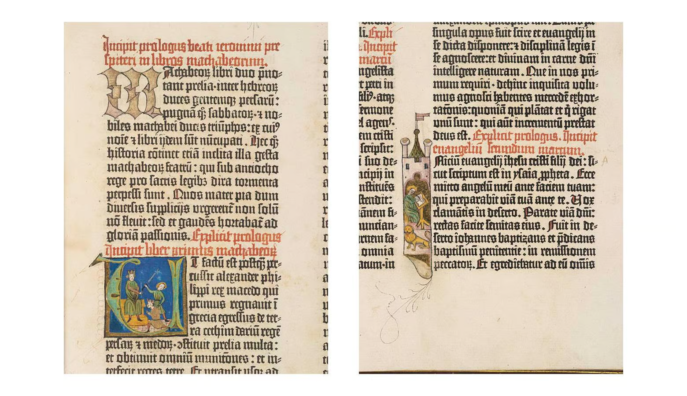

*   Blackletter typefaces used to be the standard for printing (sort of like the default font), because they were similar to that era’s handwriting style.
*   Additional info: The first major mass produced printed book was the Gutenberg Bible, which marked the start of the Gutenberg Revolution (seriously? What a narcissist), which was an unprecedented mass-spread of literature throughout Europe. The number of books rose from thousands to millions.

*   But they took up a lot of space, so some bloke named Nicolas Jenson created a simpler style of typeface in 1470, known as a roman typeface (the other 2 styles are blackletter and italic), based on blackletter and italian humanist lettering

(Nicolas Jenson, Fr\*nch)

*   This resulted in shorter books and faster setup times.
*   Jenson’s roman typeface formed the basis of several modern fonts, including Centaur (created by Bruce Rogers in 1914) and Adobe Jenson (created by Robert Slimbach in 1996)
*   1501 - Aldus Manutius and Francesco Griffo created the first italic typeface, which allowed even more text to fit on the page.
*   Nowadays italics are used as a way to emphasise text.

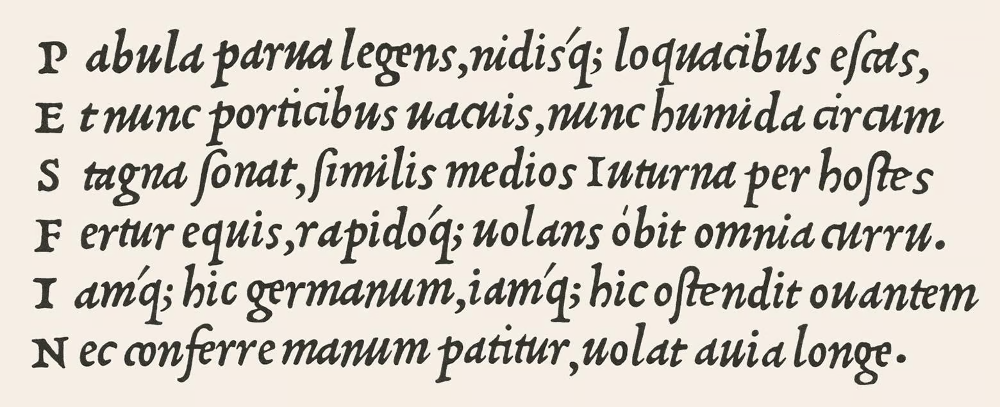       

*   1734 - guy named William Caslon invented a more readable typeface because the old ones were kinda shit (bad readability)

*   The new typeface included more contrasts between strokes in each letterform.
*   Now referred to as “Old Style” type, these typefaces made letterforms more distinguishable, and therefore more readable.

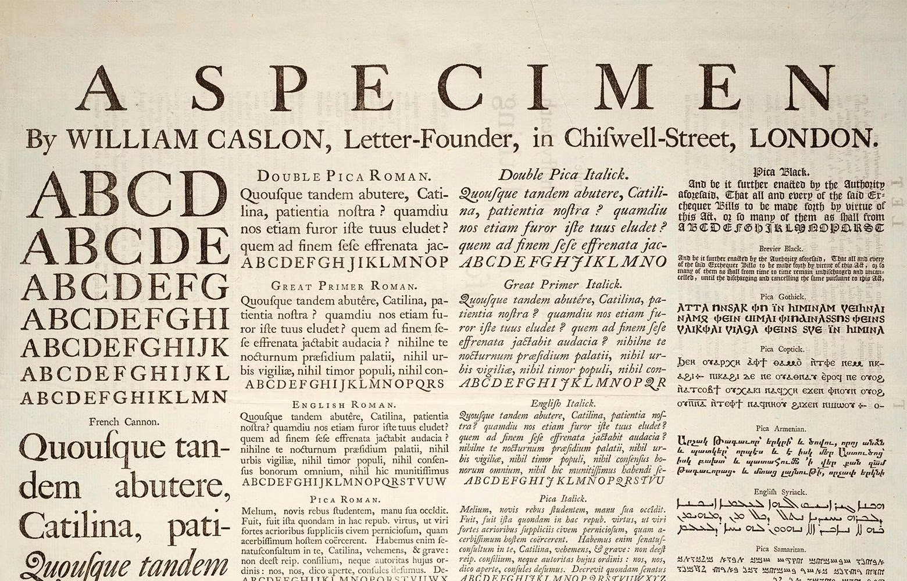

*   1757 - dude named John Baskerville created Transitional Typefaces (what the fuck is a Transitional Typeface? - it’s a mix of old style and modern style typefaces, hence why it’s called “transitional”)

*   Apparently this typeface was darker than others and was heavily criticised for being too thick - at that time, it was a commercial failure.
*   However, this typeface would become popularised in the 20th century and John Baskerville would be hailed as the “greatest printer England ever produced”.

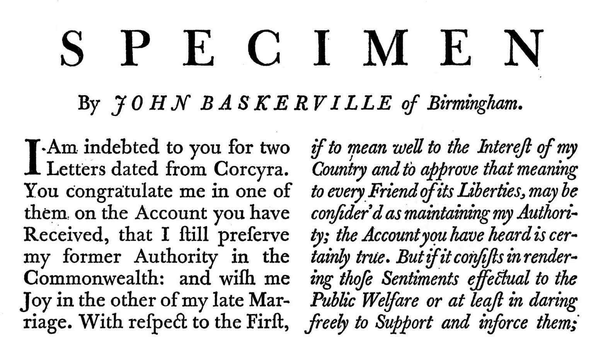

### Modern Serifs

*   1780 - 2 type designers, Firmin Didot (left) in France and Giambattista Bodoni (right) in Italy (god i hate these names) created modern serifs with extreme contrasts between strokes.

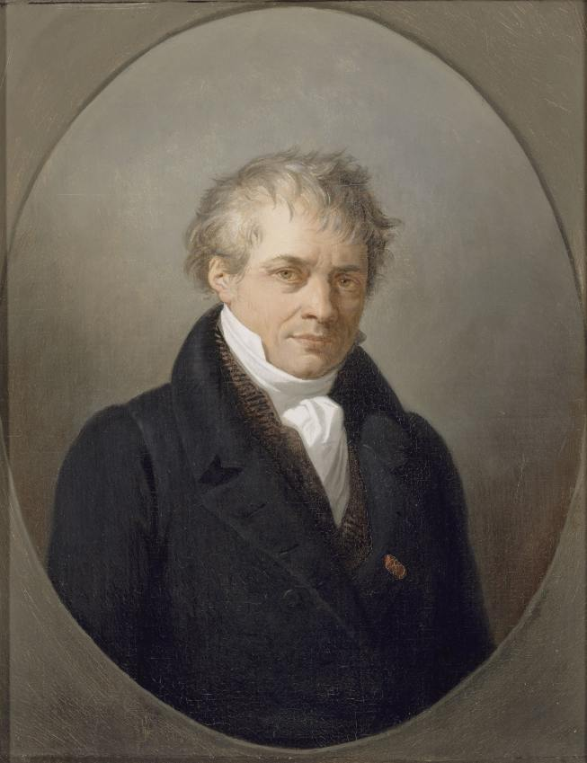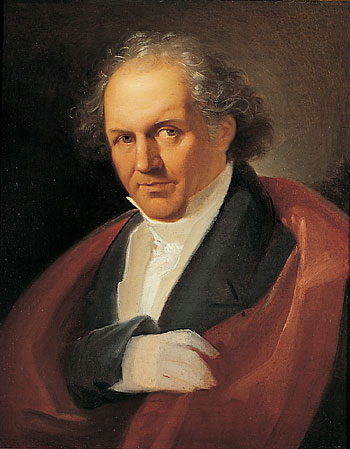

*   There are some distinct differences between the two fonts, mostly in the appearance and placement of particular letterforms. For example, the uppercase J in Bodoni extends below the baseline, while in Didot it sits on the baseline. The strokes on the “3” in Bodoni are both terminated with balls, while only the upper stroke is terminated with a ball in Didot.

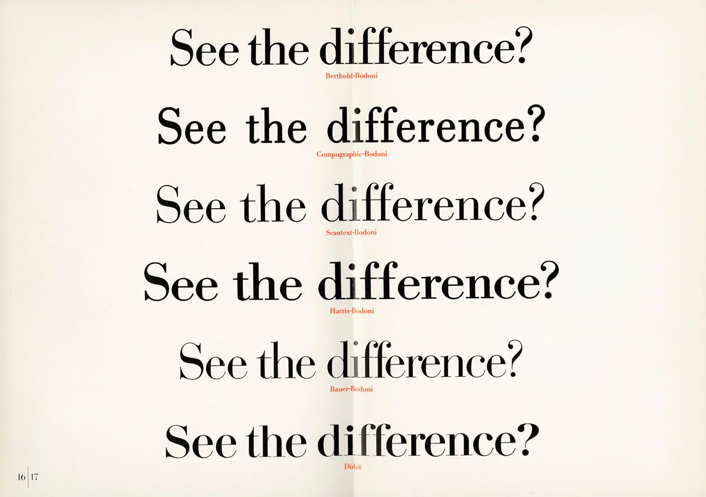

*   1815 - First commercially available slab serif / egyptian typeface called “Antique” appeared, designed by Vincent Figgins.

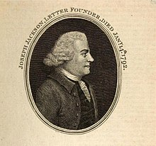

*   The primary characteristic of slab serif fonts is the lack of curvature on the serifs.
*   They quickly grew in popularity in the 19th century, alongside the rise in printed advertising.
*   Some slab serifs were developed specifically to be used at larger sizes for printed matter like posters. This was a departure from earlier large-scale type designs, which adapted existing forms of book type.

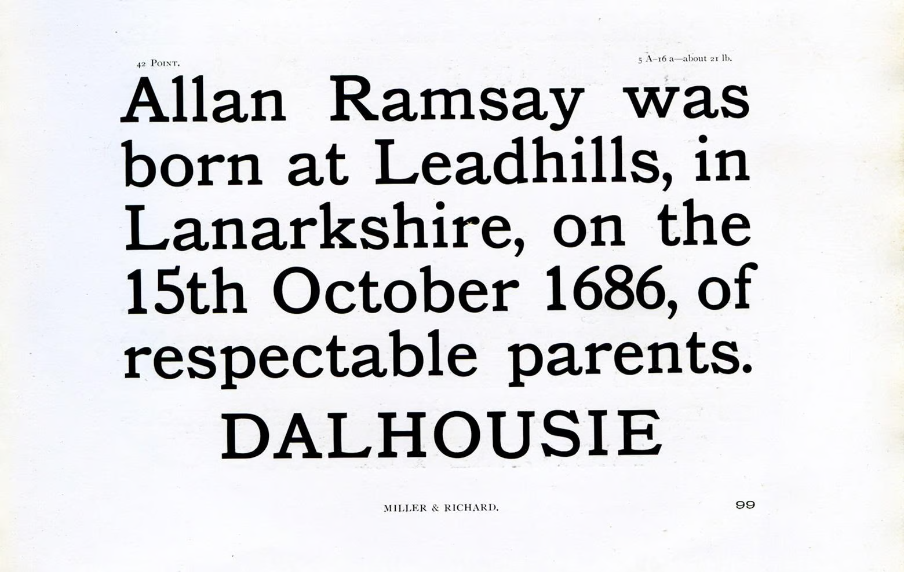

*   Large scale advertising design also brought about the first sans serif typeface.
*   Around the same time the first slab serif type became available, the first sans serif type became commercially available.
*   William Caslon IV developed “2 lines english egyptian” also known as “caslon egyptian” in 1816.
*   Advertisements and other printed material in the 1800s used this font widely.
*   Sans Serif was influenced by block lettering that was commonly used in classical antiquity, in which serifs were minimal or missing entirely.
*   During the early 1800s, Egyptomania spread across the West and both typography and design took inspiration from ancient egypt.

*   Next significant development in Sans Serif type came 100 years later when some guy named Edward Johnston designed the typeface for the London Underground.
*   First full time type designer was Frederic Goudy in the 1920s.

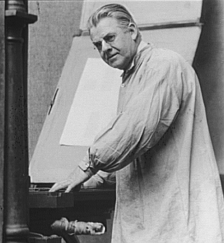

*   Created iconic fonts such as Copperplate Gothic and Goudy Old Style (based on Jenson’s Old Style typefaces)
*   1957 - Max Miedinger designed Helvetica, probably most iconic typeface of the 20th century.
*   Other minimalist typefaces developed in that era were Futura (Paul Renner) and Optima (Hermann Zapf)

### Digital Typography

*   Digi Grotesk - First digital typeface designed by Rudolf Hell in 1968.

*   Early digital fonts were bitmaps, which resulted in bad readability at small sizes.
*   1974 - First outline (vector) fonts developed, resulting in better readability while reducing file sizes.
*   Late 1980s - TrueType fonts were created (collaboration between Apple and Microsoft!!!!), which allowed for both computer displays and output devices like printers to use a single file.

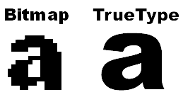

*   1997 - OpenType fonts (an extension of TrueType) were invented which allowed both MacOS and Windows to use a single font file.
*   In the same year, CSS incorporated the first-ever font styling rules, and the following year, the first support for web fonts was added to Internet Explorer 4 (though they weren’t widely adopted at that time)

#### Typeface Evolution on the Web

*   2009 - Web Open Font Format (WOFF) developed and added to the WC3 open web standard -> paved the way for widespread adoption of web fonts in 2011 when all major browsers adopted support for WOFF.
*   2016 - Introduction of variable fonts within the OpenType standard (variables can change size and weight based on where they are used in a design, within a single font file, which means fewer font files and faster page loading times).

### Summary

[Summary](https://www.google.com/url?q=https://assets.toptal.io/images?url%3Dhttps%253A%252F%252Fbs-uploads.toptal.io%252Fblackfish-uploads%252Fuploaded_file%252Ffile%252F248907%252Fimage-1588949096149-03cbdc8c532e1a07743725fb64a46fd6.png&sa=D&source=editors&ust=1715517616013620&usg=AOvVaw1SrDQ0jG053LzGLJRaxh5z)

OMG I'M FINALLY DONE WITH THIS BLOODY ARTICLE!!!!!!!

Microsoft Updates its Font
--------------------------

*   Ever since 2007, Calibri has been the default font for Microsoft Office applications such as Outlook & Word. (before that it was Arial & Times New Roman, (Arial is actually Google Docs’ default font!))

*   Additional infodump: The change from the old default fonts to Calibri is actually a response to the switch from lower-res CRT Screens to higher-res LCD screens. Calibri is a ClearType font, ClearType was developed by Microsoft, specifically to suit LCD Screens which were very different to CRT screens. (this is a gross oversimplification but you get the point)

*   5 different fonts were actually considered before Aptos was chosen.

*   In 2023/early 2024 (idk all the articles on this don't mention a specific date ugh) Microsoft is updating the font from Calibri to Aptos (formerly called Bierstadt), they update their fonts once in a while to make office apps look fresh and give consumers more reason to part with their $$$.
*   Aptos was made by some guy called Steve Matteson
*   They changed the name from Bierstadt (“beer city” in German, also the name of a mountain in Colorado) to Aptos (some town in Santa Cruz County, California) because people didnt take it seriously apparently (i wouldnt too tbh how the fuck do you even pronounce that)
*   One good thing about Aptos is that its easy to tell between capital I and lowercase l (i freaking love this).

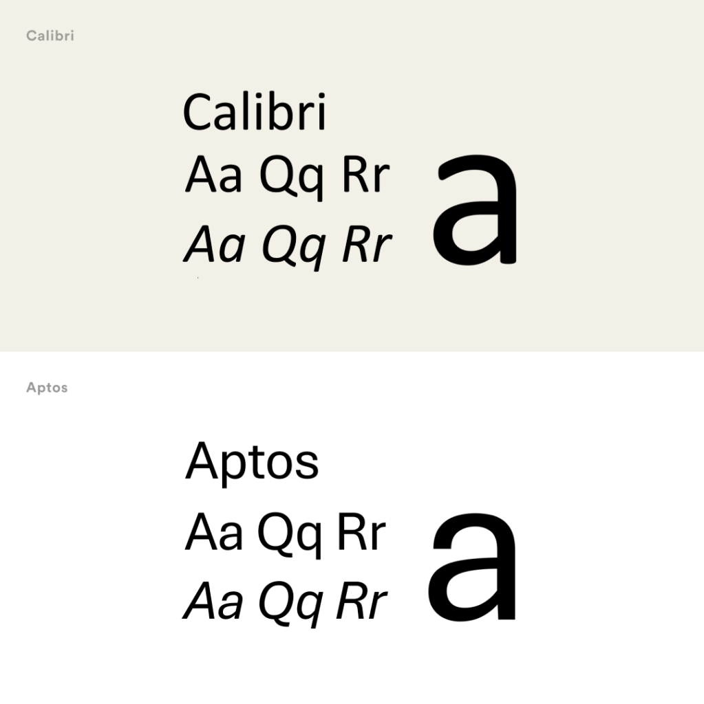

### Steve Matteson

because WSC might want this info idk

*   Worked for the font company Monotype.
*   Helped with Microsoft’s TrueType fonts for Windows 3.1
*   Created Segoe Font
*   Contributed to some font named Curlz.
*   When Aptos was still in its proposal stage it was simply called Grotesque No. 2, it was then given a codename by Microsoft called Koyuk.

London Underground Typeface
---------------------------

*   Remember how I said some guy named Edward Johnston created the font for the London Underground? (it was called Johnston Sans) - Well, they’re making a teeny tiny minor change to it! (in 2016 ofc)
*   Designer Eicchi Kono updated the typeface in the 1970s to adapt it to new printing technology, making changes like turning full stops into diamonds.
*   They’re changing it again in 2016 to “make it fit for its purpose in the 21st century” (im paraphrasing)
*   They’re naming the modified version “Johnston100”

*   Honestly I can’t notice the difference
*   Oh wait the hole in g is bigger
*   New symbols were also added such as # and @
*   extra-thin weights of the typeface have been created so that the same lettering can be used for mobiles as in stations

### Extra History

*   In 1916 the London Underground ordered a new typeface for its posters and signage from calligrapher Edward Johnston.
*   Until then, printed script tried to reproduce the calligraphic fancies of Victorian handwriting, with its decorative curls and flourishes, known as "serifs" in printer's jargon. The new letters deliberately left out the flourishes.
*   The new typeface was easier to read and applied portions of Roman capital letters.
*   It was revolutionary for typefaces
*   Guy named Eric Gill, who was formerly Johnston’s pupil further improved on Johnston Sans (the name of Johnston’s typeface)
*   Eric was born in 1882 and died in 1940
*   His best known statues include "Ecstasy" (Tate Galleries), the stations of the cross at Westminster Cathedral, "Ariel Between Wisdom and Gaiety" outside BBC Broadcasting House and the seahorses of Morecambe's Midland Hotel
*   Biography by historian Fiona MacCarthy showed that apparently Eric Gill had “recorded sexual activity with two of his teenage daughters, his sisters and his dog” (wtf is this 😭?????? Like wtf did i just actually read ☠️ 🙏)
*   Gill experimented with an even simpler design - by hand - on the sign above a friend's bookshop in Bristol. That lettering caught the eye of an adviser to the company Monotype (hey its the company Steve Matteson the microsoft font guy worked for!!!), which designed print for advertising and publishing and is still in business today. Monotype commissioned Gill to develop the typeface.
*   Edward Johnston is now in a grave in a Ditchling churchyard (idk why this might be relevant but oh well)

U.S. State Dept. Font Change
----------------------------

*   2004 -> Courier New 12 was exchanged for Times New Roman as the standard font because “it takes up almost exactly the same area on the page as Courier New 12 while offering a crisper, cleaner, more modern look”.
*   2016 -> Times New Roman was exchanged for Calibri as the standard font “as a means to help employees who are visually impaired and was recommended by the secretary’s office of diversity and inclusion”
*   Apparently, according to US Secretary of State Anthony Blinken, the “decorative, angular features” of Times New Roman and other serifs “can introduce accessibility issues for individuals with disabilities who use Optical Character Recognition Technology or screen readers.” He added, “It can also cause visual recognition for individuals with learning disabilities.”

The Font Detective
------------------

*   Thomas Phinney

*   Started in DTP (desktop publishing?) in the mid 80s
*   Gradually became more interested in typography and fonts
*   Has an undergraduate in psychology and worked full time in commercial theatres for stints
*   News editor in the university newspaper for his last year of undergrad
*   It was during this time where he wrote his essay “A Brief History on Fonts” (the link was removed unfortunately 😢)
*   Went to School of Printing at RIT, the Rochester (NY) Institute of Technology, and got his masters in printing, specialising in design and typography.
*   His bloody biography is so long
*   In his day job, he is the CEO of FontLab, a font creation/editing software company.
*   Since 2004 he has been on the board at ATypl, the international typographic association.
*   From 1997-2008 he did type at Adobe, lastly as product manager for fonts and global typography.
*   After that he spent five years as senior technical product manager (a.k.a. “guru”) of fonts and typography at Extensis, including managing the font library for the WebINK web font solution.  His typeface [Hypatia Sans](https://www.google.com/url?q=http://blogs.adobe.com/typblography/2007/04/hypatia_sans.html&sa=D&source=editors&ust=1715517616022643&usg=AOvVaw31R-g3uJFej0yIvCDUXueh) is an Adobe Original (with help from Robert Slimbach, Miguel Sousa and Paul Hunt). His latest typeface is the Kickstarter-funded [Cristoforo](https://www.google.com/url?q=https://www.kickstarter.com/projects/tphinney/cristoforo-victorian-cthulhu-fonts-revived-again&sa=D&source=editors&ust=1715517616022988&usg=AOvVaw3FywIviZbIXiWckBTAkXTE).

*   Phinney as Font Detective

*   He was working as the product manager in Adobe Systems’ fonts group when his team received a request from an attorney about a suspected will forgery. They wanted to find out whether the fonts in the disputed document might provide a clue.
*   Using a digital microscope and counting individual pixels, Phinney noticed speckles of stray ink around each letter and bleeding of ink along the paper fibres. He deduced that document had been printed on an early inkjet printer at about 300 dpi. That type of printer didn’t exist in 1983, which was the year the document was written.

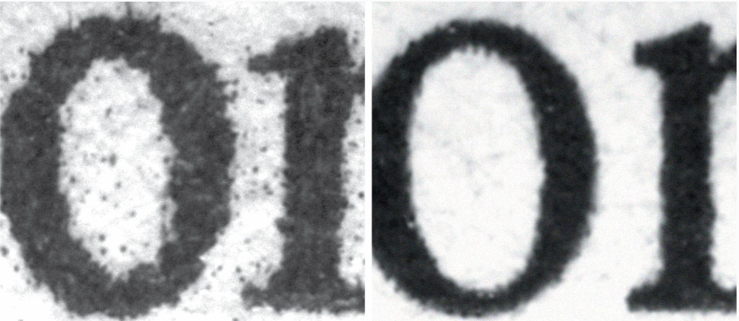

*   Another case involved a rabbi who faked his credentials to get a job (lol, should’ve just done this in India instead smh). The rabbi had taken steps to make it harder to detect, such as degrading the quality of the document by providing only a faxed copy, not the original. The document was dated 1968, but the font in which his name was printed didn’t exist until 1992.
*   In 2018 he decided to make his side gig as the Font Detective (the first in the world!) official.
*   Just 2 years after this, he earns as much as half his revenue from font forensics, and the other half from designing fonts for clients like Google.
*   Most of his cases falls into one of two categories.
*   The “nefarious” cases are those like the man who sought to prevent his wife from getting her fair share of assets in their divorce by forcing debt documents. The faked documents were printed on a 600 dpi printer that did not exist at the time they were dated but were also created in a font that did not exist at that time.
*   The other type of case he handles involves seeing if documents meet typographical legal requirements, like whether fonts were big enough to meet legal standards or whether fonts used in documents were copyrighted or stuff like that.

The Problem with Self Checkout
------------------------------

*   Dumbass customers don’t know how to identify items in their cart
*   Alcohol is inconvenient because staff have to come and check your age
*   Leads to higher merchandise losses from customer errors and intentional shoplifting
*   A study found that companies with self checkout lanes and apps had an inventory loss (“shrink”) rate of about 4%, more than double the industry standard.
*   Some products have multiple barcodes or barcodes that don’t work properly, produce such as meat and fruit need to be weighted and manually entered into the system using a code (customers sometimes type in the wrong code on accident)
*   Sometimes shoppers won't hear the “beep” confirming an item has been scanned properly.
*   Other customers take advantage of the lax oversight at self-checkout aisles and have developed [techniques](https://www.google.com/url?q=https://therooster.com/articles/master-art-stealing-self-checkout/&sa=D&source=editors&ust=1715517616025536&usg=AOvVaw0h92H6pbsyEO8V9VbHQbFH) for stealing. Common tactics include not scanning an item, swapping a cheaper item (bananas) for a more expensive one (steak), scanning counterfeit barcodes attached to their wrists or properly scanning everything and then walking out without paying.
*   Stores have tried to limit losses by tightening self-checkout security features, such as adding weight sensors. But additional anti-theft measures also lead to more frustrating “unexpected item in the bagging area” errors, requiring employees to intervene.
*   Most major shopping chains like Walmart, Costco, Wegmans, Booths, and Five Below have mostly stopped using self-checkout due to all the issues listed above.
*   In conclusion: shoppers are morons.

History of the Barcode
----------------------

*   The Birthplace of the UPC (universal product code) was in Troy’s Marsh Supermarket, Troy, Miami County, Ohio (haha!!!!! Ohio!!!! Funny state!!!! omg!!@#!!@!11!1!1) where the first item marked with UPC was scanned at checkout just after 8 AM on June 26, 1974.
*   Inventor of the Barcode, Joe Woodland, got inspiration for it on Miami beach, and drew it with his fingers on the sand.
*   The fact that such a technology was needed was not his idea but from a supermarket manager who pleaded with a dean at Drexel Institute of Technology at Philadelphia to come up with some way of getting shoppers through his store more quickly.
*   The dean ignored it but a junior postgraduate Bernard “Bob” Silver overheard and was intrigued, and mentioned it to Woodland who graduated from Drexel in 1947.
*   Woodland was confident that he could come up with a solution, so he left graduate school in winter 1948 to live in an apartment owned by his grandfather in Miami beach, where in 1949 Woodland would have his epiphany and conceive the idea of a barcode.
*   He was inspired by the dots and dashes of Morse code but instead of dots and dashes it was vertical lines of varying degrees of wideness.
*   
*   Woodland’s concept of a bull’s eye shaped Barcode (he thought a circle design would be better because it can be accurately read from any angle)        
*   Woodland and Bernard Silver filed a patent in 1949 and was granted it in 1952
*   A prototype built in Woodland’s own house used a 500w incandescent bulb, and an oscilloscope was used to read the code. The entire prototype was the size of a desk.
*   Allegedly it somewhat worked up to a point, and an objective evaluation judged it to be 20 years ahead of its time.
*   They lacked the minicomputer and a very bright light to read the code.
*   Let’s take a quick detour and talk about lasers!

*    Invented by Theodore Maiman in 1960
*   LASER is acronym for “Light Amplification by Stimulated Emission of Radiation”
*   It was hot and sharp enough to cut through materials

*   A booklet in 1966 produced by the Kroger Company signed off with a despairing wish for a better future: "Just dreaming a little . . . could an optical scanner read the price and total the sale. . . . Faster service, more productive service is needed desperately. We solicit your help." Kroger’s business was groceries, not electronics, so the company went looking for a partner with the necessary expertise.
*   A small research team at the RCA (Radio Corporation of America) decided to work on the Barcode.
*   There were some experimental ways to speed up the check out process before the barcode, like picking out punch cards that identified what they wanted to buy and presenting them to a cashier, who retrieved the goods from the store.
*   There was a patent for a system in which the supermarket shopper threw everything into a basket, which was pushed under a scanner that identified each item and printed out the bill.
*   Soon the RCA research team found the Woodland & Silver Patent (the Bull’s Eye design, not the rectangular one)
*   However, printing out the Bull’s Eye barcode was really difficult because any slight imperfections made the whole system useless.
*   However some of these problems were solved with a rotating turret of ballpoint pens and a pen designed for astronauts to write upside down.
*   All this lead up to the first real life test at the Kroger Kenwood Plaza store in Cincinnati on July 3, 1972.
*   But this was just one store, if the laser barcode were to revolutionise the checkout counter, they would have to be universal.
*   A committee was formed, called the Ad Hoc Committee of the Universal Product Identification Code (why is it such a mouthful)
*   The representatives of the grocery trade were tasked with finding a way to introduce a Universal Product Code - a Barcode of some description that would be common to all goods sold in supermarkets and imprinted by the manufacturers and retailers. (basically a barcode design competition)
*   The code would contain info about the nature of the product, the company that made it, etc.
*   Manufacturers were often a pain in the ass and didnt want a universal code (they had their own methods of identification)
*   Cardboard manufacturers were worried that a barcode might spoil their product and canners did not want to be obliged to put barcodes on their cans. It took 4 years to arrive at a workable proposition for the whole industry.
*   In the end 7 american companies submitted their barcode systems to Symbol Committee, a technical offshoot of the Ad Hoc Committee. RCA thought that it would be an ez gg win for them after having demonstrated its system.
*   However, at the last minute (classic movie protagonist surprise underdog attack move) International Business Machines (IBM) made a surprise bid. It had no tech to demonstrate to the committee and its entry appears to have been merely an afterthought. However it had Joe Woodland in its employment (the guy that designed the barcode)
*   Although he worked for IBM he was not the creator of IBM’s version of the universal bar code. That job was given to a fellow named George Laurer.

*   Laurer felt like he had an advantage over his rivals because he had no prejudices about the appearance of the barcode as the company had no ready made technology and have not given supermarket checkout systems or barcodes much thought in general.
*   Laurer was handed the specs of the Barcode that had been determined by the Symbol Selection Committee: Small and neat, maximum 1.5 square inches, it had to be printable with existing technology used for standard labels, it had been calculated that only 10 digits were needed, the barcode had to be readable from any direction and speed, and there must be fewer than 20,000 undetected errors.
*   Laurer decided to use a rectangular bar code design instead and had to try really hard to convince his bosses to accept it (which they did after a flawless demonstration)
*   The Committee made its decision on March 30th, 1973 in a New York hotel close to Grand Central Station. They picked IBM’s proposal (the rectangular bar code). - The article never goes into detail as to why but whatever
*   Kmart was the first to adopt UPC (universal product code)
*   UPC took off in grocery & retail in the 1980s
*   In 2004, Fortune magazine estimated that the bar code was used by 80-90% of the top 500 companies in the United States.
*   Funny story, in 1992 George H.W. Bush was photographed at a supermarket staring intently at a barcode scanner and having a go at swiping it. An NYT journalist (asshole) wrote this a evidence that it was the first time Bush had seen a supermarket checkout, AKA he was out of touch. Bush’s aides said that he was just amazed that it could read a damaged barcode. Regardless, a few months after the incident, Woodland was awarded with a National Medal of Technology by Bush.

Amazon Go stores
----------------

Or Indian slave labour, who knows?

### What the fuck is Amazon Go?

Amazon Go are physical Amazon stores that offer a cashierless / checkout-less shopping experience. Customers can simply enter the store, take whatever they want, and walk out, and the cost of the items will be automatically charged to their account. They call the tech “Just Walk Out” (how creative), which combines computer vision, sensor fusion, and deep learning (technobabble!), similar to tech in self driving cars.

Cameras and sensors within the store track items as customers pick them up or put them back into the shelves. Each customers has a virtual cart that keeps track of selected items, and when customers leave the store their amazon account is billed accordingly.

### How to use Amazon Go

*   Requirements: Amazon Go app, Amazon Account, and a “supported” smartphone (whatever this means).
*   Before entering the store, open the Amazon Go app on your phone and scan a code at the entry gate, which serves as your virtual entry ticket.
*   Once that’s done you can immediately start shopping and the Amazon Go technology will automatically work its magic!
*   After your shopping is done you can just walk out and your account will be automatically charged.

### Types of Amazon Go stores

*   Amazon Go: Breakfast, lunch, and snacks
*   Amazon Go Grocery: Produce, ready-made dinners, and household essentials (in the UK its called Amazon Fresh)
*   Some Amazon Go stores stock local and regional favourite products to cater to the preferences of the community.

### Where to find Amazon Go stores

They’re only in the US & UK lol. Rest of us suckers just gotta cope.

Author’s note: AHAHHAHAHAHHAHHAHHAAHHAHAHAHAHAHA apparently this tech actually kinda sucked balls so they actually hired like 1000 indians to manually review everything the customer selected LMAO. 700 out of 1000 transactions needed to be manually reviewed when amazon wanted it to be as low as 50 out of 1000 so now they’re phasing out the technology in favour of something called dash carts ☠️(this information is not in the curriculum i just found it funny)

QR Code Menus suck
------------------

### What are QR Codes?

QR (Quick Response) codes are a type of 2D barcodes, invented in 1994 by a Japanese company named Denso Wave for labelling automobile parts.

The square boxes on the QR code are called fiducial markers and are there to give cameras a perspective on their sizes.

In order to use a QR Code you need to scan it with a camera (presumably, your phone camera) and it will be processed using something known as “Reed-Solomon error correction” (super nerdy shit that I presume WSC will not care much about, but this tech is also used in stuff like CDs, DVDs, and RAID 6 storage systems). The data is then extracted from patterns that are present in both the horizontal and vertical components of the QR code. The purpose of the QR is to store more advanced stuff that barcodes can't, like links and files.

According to Hospitality Technology’s 2022 Restaurant Technology Study, 66% of restaurants in the US used QR Codes and 19% plan on adding them.

### Why they suck (or to be more specific, why [Anne Theriaul](https://www.google.com/url?q=https://thewalrus.ca/author/anne-theriault/&sa=D&source=editors&ust=1715517616035825&usg=AOvVaw2RAN5x0mzbAnCOD5KQUk7Q)t thinks they suck)

*   Makes people look at their phones instead of spending time with whoever is eating with them
*   Not easy to use (having to scroll, pinching to adjust size, etc instead of just having to glance over at the menu)
*   Websites with menus can track consumer behaviour
*   QR Codes mean people have to own an electronic device and have to be tech savvy enough to use it.
*   Waitstaff will lose their jobs because they aren’t needed anymore when there are QR Code menus (according to a bloomberg report in 2021 this has already started happening.
*   Plenty of other people hate QR Code menus too! In 2022 some bloke named Connor Friedersdorf or whatever wrote a passionate hate piece against them in The Atlantic while in 2023, NYT published an article about their alleged demise, full of quotes from people who hate them. Even looking up QR Code menu on Twitter (I refuse to call it X) shows you how much people hate them.
*   Physical menus are more aesthetically pleasing
*   Physical menus can serve as important history as to what people were eating at a particular place and time and how much it cost then (or how little).
*   New York Public Library has approx 45,000 menus dating back to the 1840s.
*   Physical Menus also tell the history of ingredients, for example even as the passenger pigeon was going extinct it was still on the menu in some restaurants, giving the perception of abundance even as the appetites of restaurant goers were driving them to extinction. Or they just used the meat of some common pigeon.
*   Menus can also tell us about the history of gender-based discrimination, an example being the “ladies’ menu”, a menu printed without prices given to women who were on a date, so that they wouldn’t know how much their dates were spending on them. This mostly disappeared after a california woman threatened a restaurant with a lawsuit.
*   In an essay titled “Today’s Special: Reading Menus as Cultural Texts”, a woman names Gora recalls working as a cook in a restaurant that served 2 versions of the same meal, “the Dirty Brunch” and “the Clean Brunch”. The Dirty came with bacon and sausages and tended to be ordered by men while the Clean came with hummus and salad and tended to be ordered by women, according to her boss.
*   Most of all, when restaurants shut down physical menus will leave a trace of what food they provided.

2: The Stuff that Dreams Are Remade Of
======================================

Butter Sculpting
----------------

Butter being used for sculpting can be traced back to “banquet art”, a tradition most associated with The Renaissance or Baroque periods. It signified a special occasion or part of the meal.

*   Earliest reference to the practice dates from 1536, and details the creations of Pope Pius V’s cook Bartolomeo Scappi, amongst which were an elephant and a tableau of Hercules engaged in combat with a lion. These sculptures were only placed on the table long enough to impress the guests, but eventually American sculptor Caroline Shawk Brooks (1840 - 1913) managed to exhibit her creations in galleries and exhibitions by using ice to keep them from melting.
*   Brooks made her first butter sculpture in 1867 after marrying a farmer. She used traditional tools instead of moulds like a butter paddle, broom straw and a “camel’s-hair pencil”

*   In 1873 she made a sculpture of the blind princess Iolanthe from Danish Poet and playwright Henrik Hertz’s verse drama King Rene’s Daughter. The sculpture was named Dreaming Iolanthe and exhibited at a Cincinnati (why is everything somehow related to Cincinnati (barcode reference)) gallery in 1874 for 2 weeks and attracted over 2,000 people.
*   Brooks made a bas-relief bust of Iolanthe for Centennial exhibition in Philadelphia, 1876, and a full-sized sculpture was shipped to France and exhibited at the 3rd Paris World’s Fair in 1878.
*   Brooks went on to study art in Paris and Florence, and although she later tended to forgo dairy for the more traditional medium of marble, she always continued to use butter as a material.
*   Other notable butter sculptors: Norwegian-American John Karl Daniels, whose works were featured in the Louisiana Purchase Exposition, St. Louis in 1904, and the Minnesota State Fair, 1910.

Cassette Tape Sculptures
------------------------

He wasn’t kidding when he said this would be boring

Erika Iris Simmons is an artist who specialises in using non-traditional media such as old books, audio cassettes, playing cards, magazines, credit cards, etc (Mother Earth probably loves her).

Using old cassette tapes, she turned them into works of art in a series that she calls “Ghost in the Machine”. The series portrays celebs and musicians such as Marilyn Monroe, Bob Dylan, Robert DiNero, Jimi Hendrix, Ian Curtis and Jim Morrison.

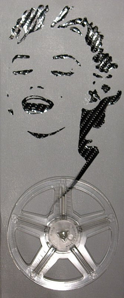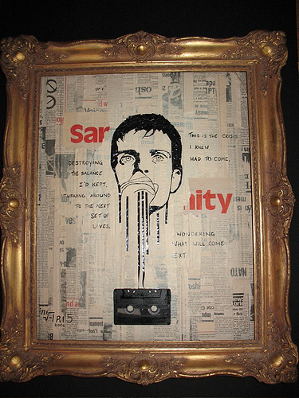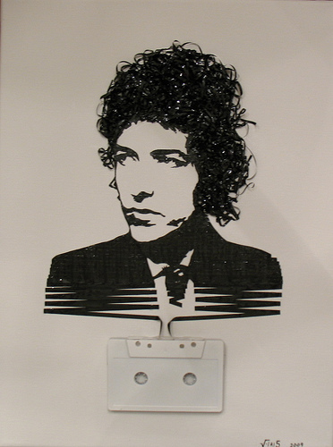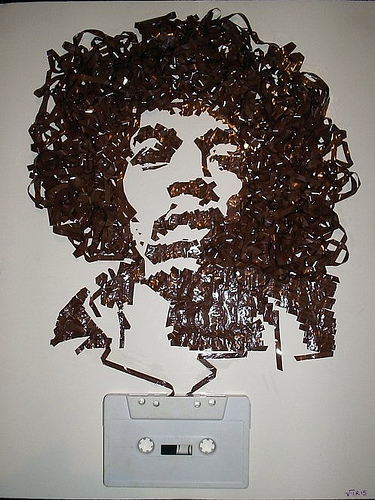 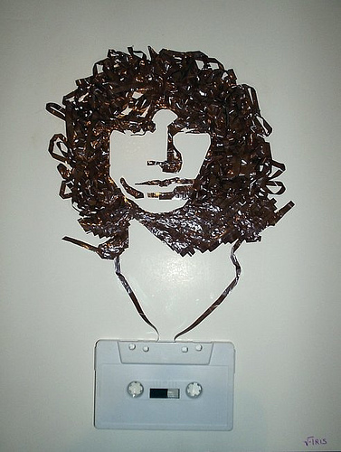

Left to right: Marilyn Monroe, Robert DeNiro, Ian Curtis, Bob Dylan, Jimi Hendrix, Jim Morrison.

Missa
-----

“Missa” is an installation of 100 army boots suspended on strings arranged in a square grid. The right boot of each pair is raised slightly off the ground, to simulate the synchronicity of military marching. The overall message of the art piece is to portray the destructive violence of oppressive totalitarian regimes, that manipulate their dehumanised troops like puppets (this reminds me of Chinese military marches). Idk man this topic sucks its literally reminding me of writer’s effect.  
  
Creator: Dominique Blain

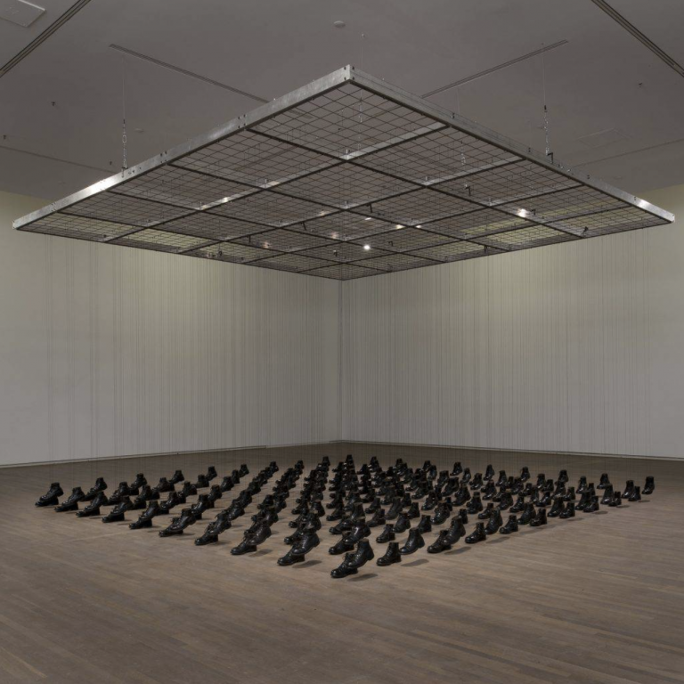

Ancient Cave Art
----------------

Ancient humans from thousands to millions of years ago used to express themselves by painting on caves around them. They carved their drawings onto muddy rocks, or left hand stencils on cave walls (handprints, sorta, idk). Majority of these were lost to time as pigments can dull or disappear, engravings can erode to nothing, and cave walls can crumble or be covered over by crusts of carbonate deposits or mud. However there are still ways to recover some of them with modern technology and techniques.

### Alabama

One such example is when Prof. Jan Simek & his colleagues in the university of Alabama discovered and published images of giant glyphs carved into the mud surface of the low ceiling in a cave in Alabama. They are some of the largest known cave images found in North America and possibly represent spirits of the underworld.

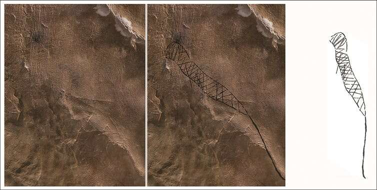

This image is a drawing of a diamondback rattlesnake, an animal sacred to the indigenous people in the south-eastern US. It stretches over almost 3 metres long.

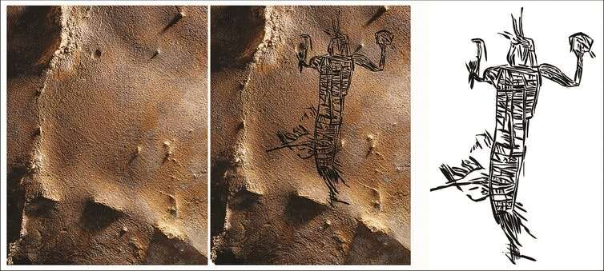

This image is a cave drawing of a human figure, just over 1.8 metres in length.

Ancient people rejuvenated a light in the cave (a flaming torch of American bamboo) by stubbing it against the cave’s wall. This left a residue that researches were able to date with radiocarbon to 133-433 AD.

The paintings were quite hard to see with the human eye as the cave ceiling was only 60cm high, making stepping back to see large images impossible.

*   They were revealed through a technique known as photogrammetry, in which thousands of overlapping photographs of an object or place are taken from different angles and digitally combined in 3D.

### Other Locations

Rock art is found almost on every continent, with the earliest being at least 64,000 years old. Rock art in the darker areas of caves beyond the reach of natural light was only discovered in North America in 1979, more than a century after its discovery in Europe (Altamira, northern Spain). Around 500 European caves are known to contain rock art from the Pleistocene Era (2.6 million years ago - 11,700 years ago, modern humans emerged during this era and spread across the world).

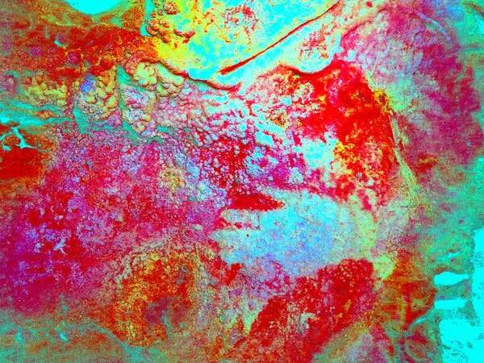

Above images show a hand stencil in the cave of Maltravieso (Estremadura, western Spain), only apparent after some image manipulation & enhancement. The stencil had been hidden and obscured by the build up of calcium carbonate deposits.

Light engravings, a common technique for rock art during the Pleistocene era, are really difficult to see. Parts of them may only become visible when shining light at an oblique angle (raking light). However, this problem is remedied with a technique known as reflectance transformation imaging (RTI), similar to photogrammetry, allows 3D models to be illuminated from any angle. These can allow us to see much more complete and complex images.

Digital Photograph of the head of an engraved bison from El Castillo Cave, Spain (left), and RTI image of the same thing (right).

### Airport Security Tech

Future archaeologists searching for rock art will most likely benefit from advancements in airport security.

Full body scanners use far infra-red frequency light that safely penetrates clothing to reveal concealed weapons or contraband, and similar techniques have been used to "see through" layers of prehistoric wall plaster to [paintings underneath](https://www.google.com/url?q=https://opg.optica.org/oe/fulltext.cfm?uri%3Doe-21-7-8126%26id%3D251706&sa=D&source=editors&ust=1715517616044417&usg=AOvVaw0d0c06dNrBVoQROfbdVgqx).

### Sulawesi

#### Leang Timpuseng Cave

Located into the Maros-Pangkep area on the island of Sulawesi, Indonesia, it has the oldest hand stencil in the world (37,900 BCE), and the second oldest painting in the world, losing only to the El Castillo Cave paintings in Spain (39,000 BCE).  (The Leang Timpuseng hand stencil is shown in the image below)

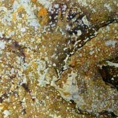

Also in the same cave is a painting of a “babirusa”, a type of Southeast Asian “pig-deer” dating to at least 33,400 BCE.

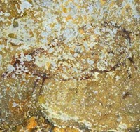 <- (the painting of the Babirusa)

Significance:

The discoveries of cave art from different parts of the world (similar art was discovered in South Africa) proves that modern humans’ cognitive ability to create art was developed before they migrated from East Africa. Before this discovery, scientists assumed that only the homo sapiens who migrated to Europe discovered this skill super early, as all old cave arts were found in western parts of Europe, like the El Castillo one that we keep talking about. When the cave was found by Alfred Wallace and the paintings discovered by H.R. van Heereken, scientists understood the homo sapiens who migrated to Australia (today’s aboriginals’ ancestors) also had this skill, therefore early humans developed this important skill before migrating!

Dating the Cave Paintings:

The paintings in Sulawesi were dated by a group of Australian-Indonesian archaeologists, using the “uranium decay technique”- they took samples from thin layers of calcite in the cave, and in calcite there is a little bit of uranium, which has a unique decaying rate relatively to other decaying rates of other materials. Using that scientists could see how much uranium there is and how much thorium there is, and so determine for how long these cave paintings stayed untouched. Most of the works were found to be around 25,000 years old.

Charles Darwin’s Finches
------------------------

Charles Darwin - guy who came up with the (now widely accepted) theory of evolution, where each different breed of animals evolved throughout the years, sometimes into different species entirely, and changes its aspects. For example, Fish > Monkey > Human (very simplified explanation of human evolution).

*   When he was a young man, he set out on a voyage around South America on the HMS Beagle in December 1831.
*   Darwin’s job was to study the local flora and fauna
*   Darwin spent most of his time on land collecting data
*   They stayed for over 3 years in South America before moving on to other places
*   The next well known stop was the Galapagos Islands off the coast of Ecuador
*   Darwin and the crew only spent 5 weeks in the islands, but it is the research he did there and the local species he brought back to England that allowed him to come up with the core of his theory of evolution and Darwin’s ideas of natural selection. He studied the geology of the region and the giant tortoises indigenous to the area.
*   One of the best known species that he brought back to England is now known as Darwin’s Finches. In reality these birds were not really part of the Finch animal family and was probably a type of blackbird or mockingbird, however Darwin wasn’t really familiar with birds so he just killed and preserved some specimens to bring back to England where he could collaborate with an ornithologist called John Gould (bird expert, fucking nerd).
*   Darwin’s Finches were like blackbirds or mockingbirds but with bigger beaks, and Darwin theorised that they probably got bigger beaks because the food in Galapagos Islands could barely be eaten with small beaks, hence all the birds with small beaks died, leaving the ones with bigger beaks (not everyone in the same species have the same features, we all have varying features like the color of our eyes or the shape of our nose, etc, these are called variations, so some birds are naturally born with bigger beaks) to survive and reproduce, hence all the descendants of the birds that lived there got bigger beaks because all their ancestors had big beaks. This is what is called natural selection.
*   There was a funny old evolution theory that preceded Darwin’s by some guy named Jean Baptiste Lamarck that said species just spawned out of nothingness like in minecraft, lol.

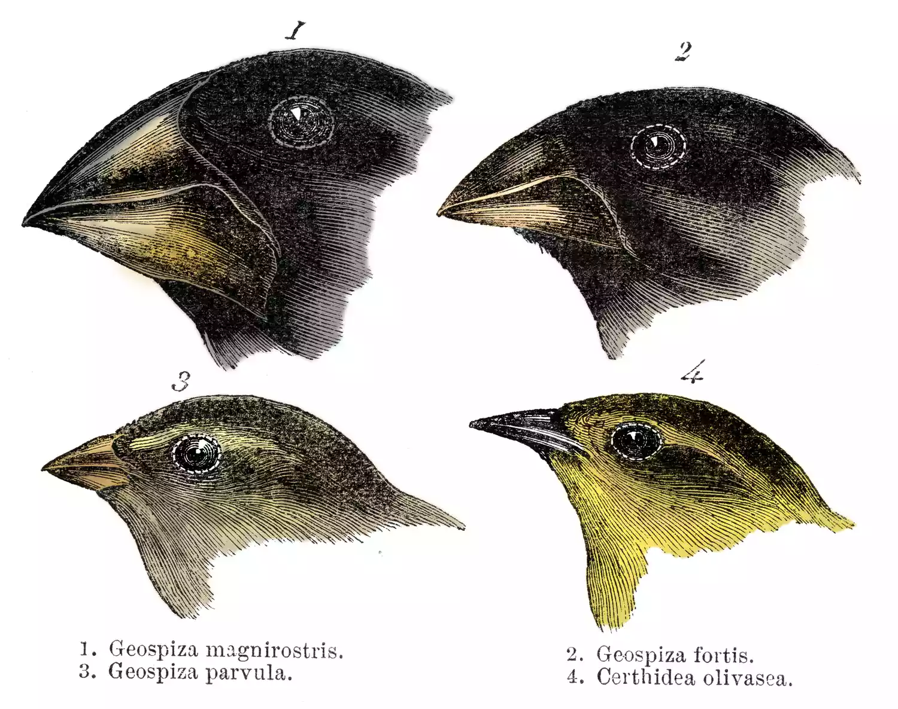<- Darwin’s Sketches

Cave Painting Replicas
----------------------

In 1940, 4 teenagers in France found a cave with hundreds of prehistoric animals painted across its walls and ceiling. The cave housed over 600 paintings and 1,000 engravings from 20,000 years ago. It became a popular tourist attraction after WWII, but had to be closed in 1963 because of the negative impacts on the cave paintings caused by tourist-generated carbon dioxide and humidity.

*   In 2017, the French government announced a plan to spend $64 million to build a replica of the original cave.
*   Archaeologist Jean-Pierre Chadelle describes the advanced techniques of the prehistoric artists: “You can see how they used a magnesium pencil for the black horns of this bull,” he says “And for the softness of the muzzle they used another technique. They blow dried paint made from natural ochre colours through a tool crafted from hollow bird bones.”

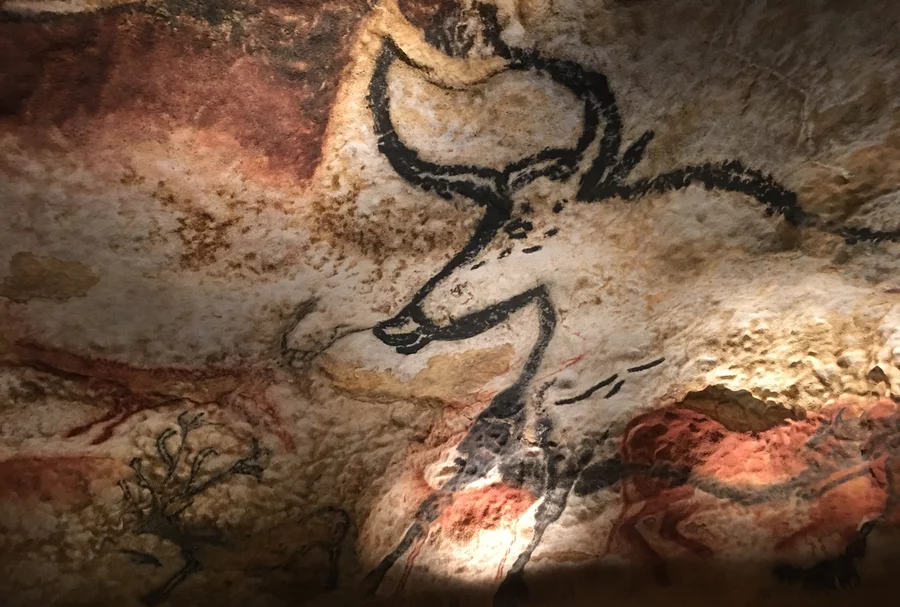

*   The reason the cave was so well preserved was because it wasn’t affected by sudden temperature changes, and there was a layer of clay in the soil that waterproofs the cave, which is why it had no stalagmites or stalactites, according to director of the new cave and museum complex Guillaume Colombo.
*   According to prehistorian Jean Clottes, the animals drawn on the cave walls don’t really represent what the humans at that time would’ve hunted and eaten, and were instead part of the religious / spiritual beliefs of these early humans. The animals they did hunt and eat at that time were mammoths or reindeers.
*   The new replica museum (cave) has many modern hi-tech features, including a personalised tablet in 10 different languages.
*   The entire complex is actually known as Lascaux IV, because it is the third and most ambitious attempt at replicating the original cave (Lascaux I).
*   The replica is precise down to 3 millimetres thanks to 3D digital scanning of the entire original cave. All the details are recreated using polystyrene and resin, and the latest fibreglass techniques.
*   The entire process took Francis Rigenbach and a team of 34 artists 3 years, with the use of projection and copying everything pixel-by-pixel. The more these artists explored and attempted to mimic the art, the more they found themselves using the exact same techniques the ancient prehistoric humans used, and also realised how they leveraged the natural surfaces and projections to their advantage.

Let’s build a pyramid in Detroit!
---------------------------------

In 1908, E.S. Wheeler of the Association of Engineering Studies gave the following as justification for his presentation of building a life-sized replica of the Pyramid of Giza in Detroit, Michigan. The twelve-acre site was to be built on fort street, home to Candillac’s village in 1702 and the site of the fort attacked by Pontiac in 1763.

*   The cost in 1908 of the pyramid (485 feet tall and 706 feet on a side) was 36,000,000 US$  ($1,222,168,695.65 US$ today)
*   Modern-day America has 312 million people, and, according to the article, if everyone put their work on the pyramid, the US can build 2.6 pyramids a day. Either this is the silly calculations of an ‘amateur’ economist or a historian mocking Egypt’s slavery and how we shouldn’t be too amazed at their wonders, because Egyptian pharaohs literally had the power of the whole country behind them.

Eiffel Tower 2: Electric Boogaloo
---------------------------------

*   Artist Phillipe Maindron built an Eiffel Tower around 1/10th of the original right next to the original, and he named it “Eiffela”.
*   He said he wanted something ‘carefree’.

### Eiffel Tower History

*   Started construction in 1887 and finished in 1889.
*   Took a team of 150-300 people to build it.
*   Made up of 18,038 iron parts, 2,500,000 rivets, and four pillars to make up the 410 foot monument.
*   It gets repainted every 7 years
*   Main function is a radio signal tower and TV broadcast tower
*   Was supposed to be temporary, you can guess how well that went.

VR: Lithodomos
--------------

*   Australian company Lithodomos has reconstructed VR of ancient wonders and lets you immerse in its former glory and tour each location in VR, as if you are travelling back in time, right from wherever you’re sitting with your VR headset.
*   It offers 60+ heritage sites and 500+ accurate 360 reconstruction.
*   It is just 6$ per location! (if only i was australian 😔)

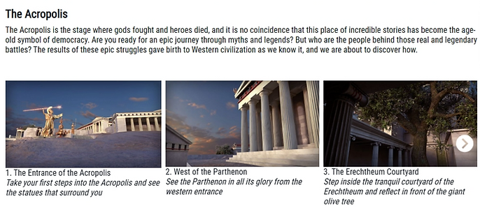

### VR Pompeii

*   Gonzaga University history prof. Andrew Goldman, an archaeologist (why is he a history professor lol), is teaching his students about pompeii using Lithodomos.
*   While travelling, Goldman met Simon Young, Lithodomos’ founder and also an Australian archeologist. He wanted to test-run the technology in a classroom setting.
*   VR used to be pretty darn expensive (still is, looky at bloody apple vision pro lmfao), but at the 6$/location price it is cheaper than some textbooks and offer a much more immersive experience!
*   Goldman remarks on how he wants his students to experience the perspective of different people in history, and not only the wealthy. Not only that, it offers information about public spaces in the past, such as textures / colours and the general environment as it was centuries ago, and leads people to wonder how they were constructed.

Other VR
--------

### Ochre Atelier

Italian artist Amedeo Modigliani is one of the most well known painters whose iconic portraits capture the face of early 20th-century Paris, he died at the age of 35 and the subsequent suicide of his young fiancee, Jeanne Hebuterne, drew more attention to his work.

*   The Tate (omg andrew tate reference?!?!?!??!?!), one of the leading modern art museums in the UK is now exhibiting a VR of his final apartment/studio in Paris in 1919 after WWI.
*   This is also the scene of his iconic self-portrait.

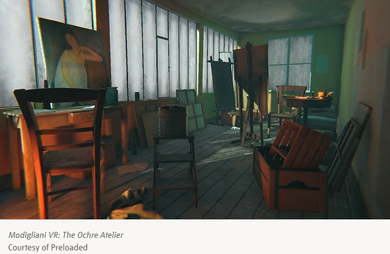

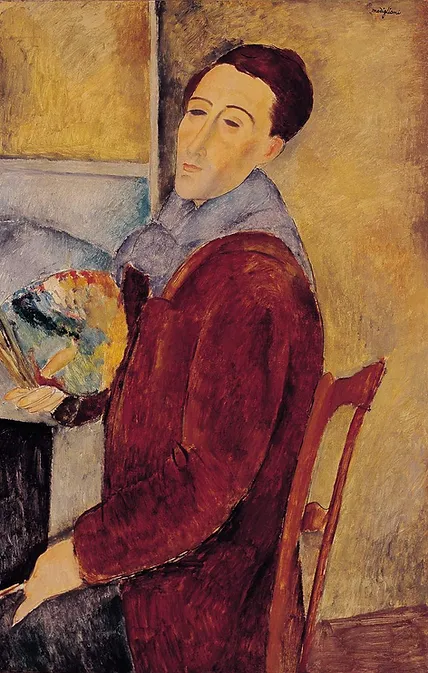

### The Opening of the Diet

Visitors to the National Museum of Finland will now be able to step back to the year 1863 by donning a VR headset and walking inside R.W. Ekman’s painting ‘The Opening of the Diet 1863 by Alexander II’. The exhibit lets visitors get a unique view of the Diet of Finland (not the food), the legislative body that existed from 1809 to 1906.

*   The VR will allow them to ‘speak’ with the emperor and representatives of the different social classes, or visit the Hall of Mirrors in what was formerly the Imperial Palace, now known as the Presidential Palace.
*   The VR experience forms part of a wider exhibition formed around 1860s Finland as an autonomous Grand Duchy of Russia. The experience was built by Zoan Oy, the largest VR experience in Finland.
*   The company has made it their mission to make Finland the most virtual society in the world.

### Ghost Hand

Inside a 19th-century Methodist Church in London is a modern museum dedicated to VR. In the back, visitors will find a tiny room called the 360: VR Room. Inside the walls are lined with black foam to block out light and sound and perfect for virtual reality journey. (its basically like a star trek holodeck lite)

For its inauguration, the Zabludowicz Collection by American artist Rachel Rossin was chosen.

The work, titled ‘I Came and Went as a Ghost Hand (Cycle 2)’ was made in 2015 during Rossin’s fellowship in virtual reality research and development at the New Museum in New York. Inside the visitors view something chaotic and definitely not real.

The world features a pale yellow background and some recognizable and pixelated items that are actually Rossin’s art studio.

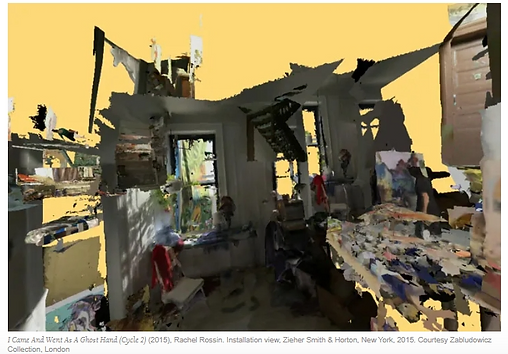

*   For Rossin, its inevitably a metaphor for entropy, the process by which digital data is compressed, distorted, or lost over time holding up a mirror to the very nature of representation as loss, as the death of the real.

### La Camera Insabbiata

*   Made by American multimedia artist and musician Laurie Anderson and Taiwanese new media artist Hsin-Chien Huang and presented at the Taipei Fine Arts Museum (TFAM) at its outdoor plaza.
*   Won Best VR Experience at the 74th Venice International Film Festival.
*   Accommodating 4 people at a time for the virtual journey, participants can travel through a total of 8 rooms: The Cloud Room, The Anagram Room, The Dog Room, The Water Room, The Sound Room, The Dance Room, The Writing Room, and The Tree Room.
*   Surrounded by murmurs of Laurie Anderson in the background (what?), viewers can wander through story clusters, leap across otherworldly and dreamy rooms, as well as fall through layers of signs and numbers.
*   "Unlike the usual mission-based VR interactive structure, La Camera Insabbiata creates exclusive worlds based on personal experiences and memories. For the exhibition, Laurie Anderson recreated a site-specific painting inside the installation. Anderson states “I make art so I can feel free and understand who I am.” Co-creator Huang mentions in his statement that “VR offers possibilities for full liberation. ‘Imagination is the only limitation’”. La Camera Insabbiata will bring intimate, exclusive and tranquil experiences in abstract and unconventional ways."

Judith and Holofernes
---------------------

This section of WSC covers art history and the many versions of famous paintings and how they are influenced by the artists' era and beliefs. These artworks tell different versions of the same historical event, creating intentional distortions which shape culture.

​

The link above is to a History.com article about the Biblical account of Judith and Holofernes in Book of Judith, and it is "a tale of female revenge, power and solidarity". Judith is a Jewish widow, who is known for her beauty. She is from the town of Bethulia, which was being invaded by an Assyrian general named Holofernes. She enters his tent, seduces him, he passes out with alcohol, and she 'brutally' cuts off his head. His head is taken away by an elderly servant named Abra. This story has inspired many artworks in the Renaissance and Baroque period, featuring the Power of Women. WSC wonders if they celebrate "female rage", what do you think?

### Judith and Red Square

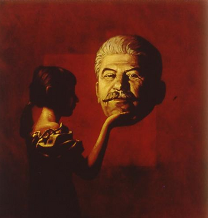

*   This painting is done by two soviet artists in exile in the 1980s, Vitaly Komar and Alexander Melamid.
*   The woman holds the decapitated head of Joseph Stalin’s statue
*   Stalin symbolises the cruel oppressor, and the young woman represents the modern generation of soviets, fighting to free their homeland from the shackles of totalitarianism. Unlike other similar paintings which feature a real human head, the head of stalin in this painting seems to be a statue, as statues were used to promote communist propaganda and give leaders God-like, supreme qualities.

### Icon for Female Rage

Art critic Angelica Fey shares in this very insightful article the history and evolution of the story of Judith beheading Holofernes. Each era, artists male and female, religious and non-religious, have imbued this Biblical story with their own interpretations. How would you describe Judith: warrior, religious wife, female assassin, beautiful noble woman, seductress, femme fatale, rape victim, minority underdog?  Historically, there have been two main types:

1) strong/virtuous woman      

2) femme fatale (sexy dangerous woman).

​

Best recapped by the article: "Based on these examples, one can see that Judith acquired relevance during periods of cultural upheaval. A straightforwardly virtuous characterization in the Middle Ages, Judith became a warrior-goddess in the service of political allegory in the Renaissance; the embodiment of female rage in the Baroque era; and the textbook definition of a femme fatale in the late 19th century. It’s not surprising, then, that even in the 21st century, Judith still has something to say to modern audiences. Hers is the story of a woman who overpowers a much stronger enemy: Whether read through a feminist or political lens, the parable of the victorious underdog holds an undying appeal." palestine > israel 🙏

### Judith evolution lmao 

Middle Ages Judith - virtuous, honourable, loyal

Early Renaissance Judith - political, symbolising minority overcoming underdog (David & Goliath, Palestine & Israel)  
Late Renaissance Judith - richly adorned noblewoman, seductive and aggressive

19th Century Judith - beautiful and wicked, more nude lmfao

21st Century Judith - Strong woman taking down oppressors (feminism)

### Judith with the head of Holofernes

By: Michael Wolgemut & William Pleydenwurff in 1493

One of the most famous early illustrated books, Nuremberg Chronicle, this ambitious text chronicles the history of the world, from the Creation to 1493, with a final section devoted to the anticipated Last Days of the World. It was illustrated with more than 1,000 woodcuts designed by the talented German artists Michael Wolgemut and Wilhelm Pleydenwurff, with the assistance of their studio apprentices, among whom was the young Albrecht Dürer. Albrecht is one of the most influential artists of the German Renaissance of late 1400s to early 1500s.

​

Judith is still very much alive and praised in the sacred world. The figure of Judith is kept alive in the Jewish Tradition on the festival of Chanukah, symbolised by the eating of salty cheese. Pope John Paul II’s homily on Judith and Mary reaffirmed Judith’s traditional parallel to the mother of Christ. Roman Catholics still chant Judith’s liturgy on Mary’s name day in the daily office. In 2008, the Judith canticle was sung in Catholic churches on September 12.

### Judith and Holofernes by Giorgio Vasari (1554)

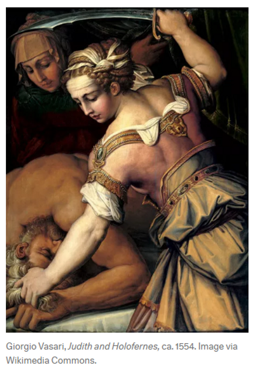

This biblical heroine’s strong arms and angled shoulders create lively diagonal lines that enhance her exaggerated musculature. Judith came to the rescue when General Holofernes and the Assyrian army laid siege to her city of Bethulia. Boldly infiltrating the Assyrian camp, Judith dined with Holofernes and, once he was drunk, she beheaded him with the help of her maid Abra. Using a pose copied from Michelangelo's Sistine Chapel ceiling, Giorgio Vasari portrayed Judith as a physically powerful woman, a visible indication of her inner courage.
